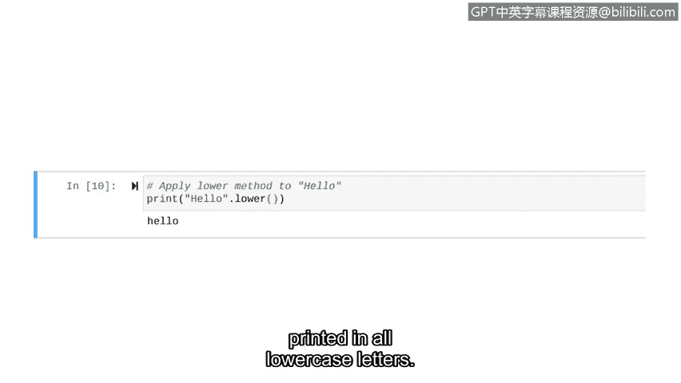

# 064：字符串操作


## 概述
在本节课中，我们将学习如何在Python中处理字符串数据。字符串操作在网络安全领域至关重要，例如，分析登录信息中的用户名模式。我们将回顾字符串数据类型，并学习其基本操作，包括创建字符串、获取长度、拼接以及使用字符串方法。

## 字符串基础回顾
字符串是由字符组成的有序序列。在Python中，字符串写在引号内，可以使用双引号或单引号。本课程主要使用双引号。

**示例字符串**：
*   `"hello"`
*   `"1,2,3"`
*   `"number one"`

变量可以存储字符串。例如，变量 `my_string` 存储了字符串 `"security"`。

## 数据类型转换：`str()` 函数
有时需要将其他数据类型（如整数或浮点数）转换为字符串。为此，我们引入内置函数 `str()`。

**`str()` 函数**：将输入对象转换为字符串。

将对象转换为字符串后，可以执行仅适用于字符串的操作，例如移除或重新排序其中的元素，这些操作对整数数据类型来说很困难。

**实践：将整数转换为字符串**
我们将对整数 `123` 应用 `str()` 函数。

```python
new_string = str(123)
print(type(new_string))
```

运行后，变量 `new_string` 包含一个由字符 `'1'`、`'2'`、`'3'` 组成的字符串。`print(type(new_string))` 的输出确认了其类型为字符串。

## 基本字符串操作
上一节我们介绍了如何创建和存储字符串。本节中，我们来看看几种基本的字符串操作。

### 1. 获取字符串长度：`len()` 函数
`len()` 函数返回对象中元素的数量。对字符串使用此函数可以告诉我们字符串包含多少个字符。

在网络安全中，此功能很有用。例如，我们知道IPv4地址最多有15个字符。安全专业人员可以使用 `len()` 函数检查IPv4地址是否有效：如果其长度超过15个字符，则可以判定为无效的IPv4地址。

**实践：计算字符串长度**
我们将计算字符串 `"hello"` 的长度，并将 `len()` 函数嵌套在 `print()` 函数中，以便先计算长度再打印结果。

```python
print(len("hello"))
```

运行后，输出为 `5`，对应单词 "hello" 中的每个字母。

### 2. 字符串拼接
字符串拼接是将两个字符串连接在一起的过程。在Python中，可以使用加号 `+` 进行拼接。

**实践：拼接字符串**
我们将字符串 `"hello"` 和 `"world"` 拼接在一起。

```python
print("hello" + "world")
```

运行后，得到 `helloworld`，两个字符串之间没有空格。需要注意的是，并非所有运算符都适用于字符串，例如，不能使用减号 `-` 来对两个字符串进行“相减”操作。

### 3. 字符串方法
方法是属于特定数据类型的函数。因此，在另一种数据类型（如整数）上使用字符串方法会导致错误。与其他函数不同，方法出现在字符串之后。

以下是两种常见的字符串方法：

*   **`.upper()` 方法**：返回字符串的全大写副本。
*   **`.lower()` 方法**：返回字符串的全小写副本。

**实践：使用字符串方法**
让我们对字符串 `"Hello"` 应用 `.upper()` 方法。注意方法的独特语法：在字符串 `"Hello"` 后加一个点 `.`，然后指定要使用的方法 `upper`。

```python
print("Hello".upper())
```

运行后，屏幕打印出全大写的 `HELLO`。

类似地，我们对字符串 `"Hello"` 应用 `.lower()` 方法。

```python
print("Hello".lower())
```

运行后，屏幕打印出全小写的 `hello`。



## 总结
本节课中，我们一起学习了Python中字符串的基本操作。我们回顾了字符串的定义和创建方式，学习了如何使用 `str()` 函数进行类型转换。接着，我们探索了三种核心操作：使用 `len()` 函数获取字符串长度、使用 `+` 运算符进行字符串拼接，以及使用 `.upper()` 和 `.lower()` 方法改变字符串大小写。这些是处理文本数据的基础，在后续分析登录信息、检查数据格式等网络安全任务中会经常用到。接下来，我们将深入学习更多关于字符串的知识，例如字符串索引和分割。