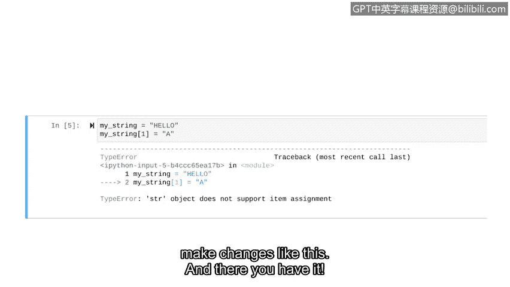

# 065：字符串索引与切片


在本节课中，我们将要学习Python中字符串的索引和切片操作。这些是处理和分析文本数据的基础，对于网络安全任务（如搜索日志文件中的特定信息）至关重要。

## 概述

在网络安全领域，我们经常需要搜索字符串。例如，我们可能需要在安全日志中定位一个用户名，或者在网络日志中搜索与恶意软件关联的特定IP地址。能够使用Python进行此类操作的第一步，就是了解字符串中字符的索引。

## 字符串索引

索引是一个分配给序列中每个元素的数字，用于指示其位置。对于字符串，索引就是每个字符在字符串中的位置。

以字符串 `"hello"` 为例。在Python中，字符串中的每个字符都被分配了一个索引，并且**索引从0开始计数**。因此，字符 `'H'` 的索引是 `0`，`'e'` 的索引是 `1`，依此类推。

让我们在Python中实践如何使用索引。将索引放在字符串后面的方括号中，可以返回该索引位置的字符。

```python
"hello"[1]
```

运行这行代码，将返回字符 `'e'`。请记住，索引从0开始，所以索引 `1` 对应的是字符串中的第二个字符。

## 字符串切片

如果我们想提取字符串中不止一个字符的部分，该怎么办？这时可以使用切片操作。切片允许我们通过指定起始和结束索引来提取字符串的一部分。

切片语法是：`string[start:end]`。其中：
*   `start` 索引是切片的起始位置（包含在输出中）。
*   `end` 索引是切片的结束位置（**不包含**在输出中）。Python会在第二个索引之前的元素处停止切片。

例如，如果我们想从 `"hello"` 中提取字母 `'e'`, `'l'`, `'l'`（即索引1, 2, 3），我们需要从索引 `1` 开始，在索引 `4` 之前结束。

```python
"hello"[1:4]
```

运行这段代码，输出结果为 `'ell'`，这正是我们想要的切片。

## 使用 `index` 方法搜索字符串

现在我们已经知道如何描述字符串中字符的位置，接下来学习如何在字符串中进行搜索。为此，我们需要使用字符串的 `index` 方法。

`index` 方法用于查找输入内容在字符串中**第一次出现**的位置，并返回其索引。

让我们在Python中练习使用 `index` 方法。假设我们想在字符串 `"hello"` 中找到字符 `'e'` 的位置。

```python
"hello".index("e")
```

详细看一下这行代码：在写出字符串后，我们使用 `.index()` 方法，并将我们想要查找的字符 `"e"` 作为该方法的参数。请注意，Python字符串是区分大小写的，因此在使用 `index` 方法时需要确保大小写匹配。

运行这段代码，返回数字 `1`。这是因为 `'e'` 的索引值是 `1`。

现在，让我们探索一个字符在字符串中重复多次的例子。尝试搜索字符 `'l'`。

```python
"hello".index("l")
```

运行这段代码，结果是索引 `2`。这告诉我们，`index` 方法只识别字符 `'l'` 的**第一次出现**，而不是第二次。这是使用 `index` 方法时需要注意的一个重要细节。

作为安全分析师，学习如何使用索引可以让你在字符串中找到特定部分。例如，如果你需要找到电子邮件中 `@` 符号的位置，你可以用一行代码使用 `index` 方法找到它。

## 字符串的不可变性

现在，让我们将注意力转向字符串的一个重要特性：不可变性。

在Python中，**字符串是不可变的**。这意味着字符串在创建并被赋值后，其内容无法被更改。

让我们通过一个例子来理解这一点。首先将字符串 `"hello"` 赋值给变量 `my_string`。

```python
my_string = "hello"
```

现在，如果我们想将字符 `'e'` 改为 `'a'`，让 `my_string` 的值变成 `"hallo"`，我们可能会尝试使用索引表示法来直接修改。

```python
my_string[1] = "a"  # 这行代码会导致错误
```

但是，这样操作会导致一个错误。因为 `my_string` 是不可变的，所以我们不能以这种方式进行更改。




## 总结

本节课中我们一起学习了字符串的索引和切片操作。你学会了如何通过索引定位单个字符，以及如何使用切片提取字符串的一部分。我们还探索了如何使用 `index` 方法在字符串中搜索内容。最后，你了解了字符串的一个重要特性——**不可变性**，这意味着字符串在定义后，其中的字符不能被重新赋值。

接下来，我们将学习列表操作，并会发现列表是可以通过索引表示法来改变的。


