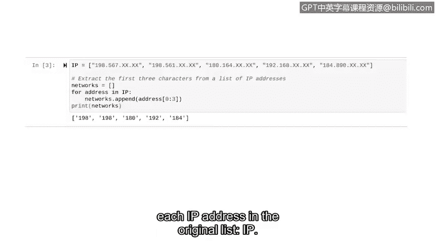

# 067：编写简单算法 🧮


在本节课中，我们将要学习算法的基本概念，并了解如何将问题分解为步骤，最终使用Python编写一个简单的算法来解决网络安全中的实际问题。

---

## 什么是算法？ 🤔

在我们的日常生活中，我们经常遵循规则来解决问题。一个简单的例子是，假设你想喝一杯咖啡。如果你多次制作过咖啡，那么你可能会遵循一个流程：首先，你拿起你最喜欢的杯子；然后，你将水倒入咖啡机并加入咖啡粉；接着，你按下启动按钮并等待几分钟；最后，你享用新鲜煮好的咖啡。

即使你有不同的煮咖啡方法或者根本不喝咖啡，你也可能遵循一套规则来完成类似的日常任务。当你完成这些常规任务时，你就是在遵循一个**算法**。

**算法**是一套用于解决问题的规则。更详细地说，算法是一系列步骤，它从问题中获取输入，利用这个输入执行任务，并返回一个解决方案作为输出。

---

## 网络安全中的算法应用 🛡️

上一节我们介绍了算法的基本概念，本节中我们来看看算法如何在Python中用于解决网络安全问题。

想象一下，你作为一名安全分析师，有一个IP地址列表。你想提取每个IP地址的前三位数字，这将告诉你这些IP地址所属网络的信息。为了实现这个目标，我们将编写一个涉及多个已学Python概念的算法：**循环**、**列表**和**字符串**。

以下是存储为字符串的IP地址列表（出于隐私原因，示例中未显示完整地址）：
```python
IP = ["198.5.6.7", "192.168.1.1", "10.0.0.1"]
```
我们的目标是从每个地址中提取前三个数字，并将它们存储在一个新列表中。

---

## 分解问题：从单个IP地址开始 🧩

在编写任何Python代码之前，让我们先分解一下用算法解决这个问题的思路。如果你只有一个IP地址，而不是整个列表，问题会变得简单得多。

解决此问题的第一步是使用**字符串切片**从一个IP地址中提取前三位数字。

现在，让我们考虑如何将其应用于整个列表。作为第二步，我们将使用一个**循环**将该解决方案应用于列表中的每个IP地址。

---

## 实现步骤一：字符串切片 ✂️

之前你已经学习了字符串切片。让我们编写一些Python代码来解决一个IP地址的问题。

我们从以“198.5.6.7”开头的IP地址开始，并编写几行代码来提取前三个字符。我们将使用方括号表示法来切片字符串。

```python
address = "198.5.6.7"
print(address[0:3])
```
在打印语句中，`address`变量包含我们要切片的IP地址。请记住，Python从0开始计数，因此要获取前三个字符，我们从索引0开始切片，一直到索引3。Python会排除最终索引，换句话说，它将返回索引0、1和2处的字符。

运行此代码，我们得到地址的前三位数字：`198`。

---

## 实现步骤二：循环与列表操作 🔄

现在我们已经能够解决一个IP地址的问题，我们可以将此代码放入循环中，并将其应用于原始列表中的所有IP地址。

在开始之前，让我们介绍一个将在此代码中使用的方法：`append`方法。`append`方法将输入添加到列表的末尾。例如，假设`my_list`包含`[1, 2, 3]`，使用以下代码，我们可以使用`append`方法将`4`添加到此列表中：
```python
my_list = [1, 2, 3]
my_list.append(4)
print(my_list)  # 输出: [1, 2, 3, 4]
```

现在我们已经准备好从列表中的每个元素中提取前三个字符。

首先，我们给定IP列表：
```python
IP = ["198.5.6.7", "192.168.1.1", "10.0.0.1"]
```
然后，我们创建一个空列表来存储从列表中提取的每个IP地址的前三个字符：
```python
networks = []
```

---

## 整合算法：循环遍历列表 📝

以下是整合后的算法实现。在循环开始前，我们先简要说明一下结构。

我们将使用一个`for`循环来遍历`IP`列表中的每个地址。在循环内部，我们对每个地址进行切片，并使用`append`方法将结果添加到`networks`列表中。

```python
IP = ["198.5.6.7", "192.168.1.1", "10.0.0.1"]
networks = []

for address in IP:
    # 提取前三个字符并添加到新列表
    networks.append(address[0:3])

print(networks)
```
让我们分解一下`for`循环：
*   `for`告诉Python我们即将开始一个`for`循环。
*   我们选择`address`作为循环内的变量。
*   我们指定名为`IP`的列表作为可迭代对象。
*   当循环运行时，`IP`列表中的每个元素将临时存储在`address`变量中。
*   在`for`循环内部，我们有一行代码将`address`的切片添加到`networks`列表中。这里使用了我们之前编写的代码来获取IP地址的前三个字符，并使用了`append`方法将其添加到`networks`列表的末尾。

最后，我们打印`networks`列表并运行代码。现在，`networks`变量包含了原始`IP`列表中每个IP地址前三位数字的列表。

---



## 总结 📚

本节课中我们一起学习了算法的概念，并通过一个网络安全中的实际例子——提取IP地址的网络前缀——实践了如何设计和实现算法。我们首先将问题分解为更小的步骤：先解决单个IP地址的切片问题，然后通过循环将其扩展到整个列表。我们还使用了`append`方法来构建新的列表。


设计算法可能具有挑战性，因此在开始编写代码之前，将其分解为更小的问题是一个好主意。在接下来的视频中，我们将继续练习这个思路。