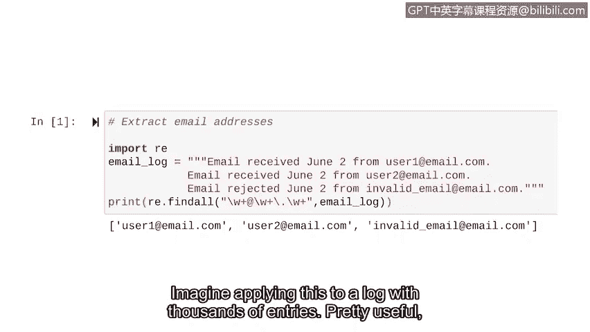

# 068：正则表达式在Python中的应用


## 概述
在本节课程中，我们将学习如何使用正则表达式在Python中搜索字符串模式。正则表达式是一种强大的工具，能帮助我们从大量文本数据（如日志文件）中高效地提取特定模式的信息，例如IP地址或电子邮件地址。

## 从字符串操作到模式搜索
上一节我们学习了如何使用位置索引和切片来处理字符串，例如从一个IP地址列表中提取前三位数字。本节我们将关注一种更高级的字符串搜索方法：正则表达式。

正则表达式（常缩写为regex）是一个用于形成搜索模式的字符序列。这个模式可以用于在日志文件等文本中进行搜索。我们可以用它来查找任何类型的模式，例如所有以特定前缀开头的字符串，或所有特定长度的字符串。

在网络安全领域，正则表达式有多种应用方式。例如，假设我们需要找到所有网络ID为184的IP地址，正则表达式能让我们高效地搜索这种模式。

## 正则表达式的核心概念
为了理解正则表达式如何工作，让我们先学习两个基础符号。

### 加号 `+`
加号是一个正则表达式符号，代表其前面的字符出现**一次或多次**。

**公式**：`a+`

这个模式会匹配任何连续出现一个或多个“a”的字符串。例如，单个“a”、连续的三个“a”（`aaa`）或连续的五个“a”（`aaaaa`）都能匹配。

为了更直观地理解，请看以下包含设备ID的字符串示例：
```
a
aa
a
aaa
```
如果我们让Python查找匹配 `a+` 模式的字符串，它将返回这个列表：`[‘a‘， ‘aa‘， ‘a‘， ‘aaa‘]`。

### 反斜杠加`\w`
`\w` 符号匹配任何**字母数字字符**（即字母a-z， A-Z， 数字0-9以及下划线_），但它不匹配符号。

**代码**：`\w`

例如，字符“1”、“K”和“i”都能被 `\w` 匹配。

## 组合模式：`\w+`
正则表达式的强大之处在于可以组合符号以创建更复杂的模式。在应用它们提取电子邮件之前，我们先看看将 `\w` 与 `+` 组合的效果。

`\w` 匹配任何字母数字字符，而 `+` 匹配其前面字符的任意多次出现。因此，`\w+` 这个组合能匹配**任意长度的字母数字字符串**。

**公式**：`\w+`

`\w` 提供了匹配字符类型的灵活性，`+` 则提供了匹配字符串长度的灵活性。字符串“192”、“ABC123”和“security”都是能被 `\w+` 匹配的例子。

## 构建电子邮件地址的正则表达式
现在，让我们应用这些知识来从日志中提取电子邮件地址。电子邮件地址通常由被特定符号（如`@`和`.`）分隔的文本组成。

一个典型的电子邮件地址格式是：`username@domain.com`。

以下是构建匹配此模式的正则表达式的步骤：

1.  **用户名部分**：由字母数字字符组成，长度可变。我们可以使用 `\w+` 来匹配。
2.  **“@”符号**：这是电子邮件地址的固定部分。我们直接在表达式中写入 `@`。
3.  **域名部分**：同样由字母数字字符组成，长度可变。我们再次使用 `\w+`。
4.  **“.”符号**：这也是固定部分。但在正则表达式中，点号`.`本身是一个特殊字符（代表匹配任何单个字符）。为了匹配字面意义上的点号，我们需要在其前面加上反斜杠进行转义，即 `\.`。
5.  **顶级域名**：如“.com”、“.net”，也是字母数字字符串。我们继续使用 `\w+`。

将所有这些部分组合起来，就得到了用于查找电子邮件地址的完整正则表达式模式。

**公式**：`\w+@\w+\.\w+`

这个模式将匹配所有符合标准结构的电子邮件地址，并排除字符串中的其他内容，因为我们在模式中精确指定了 `@` 和 `.` 出现的位置。

## 在Python中应用正则表达式
让我们将理论付诸实践，在Python中使用正则表达式从字符串中提取电子邮件地址。

要在Python中使用正则表达式，首先需要导入 `re` 模块。

**代码**：
```python
import re
```

假设我们有一个多行字符串变量 `email_log` 存储了日志内容。我们将使用 `re` 模块的 `findall()` 函数。

`re.findall()` 函数接收两个主要参数：要匹配的正则表达式模式，以及要在其中搜索的字符串。它返回一个包含所有匹配项的列表。

**代码**：
```python
# 假设 email_log 是一个包含日志文本的字符串变量
email_log = “““日志行1包含 user1@example.com
日志行2包含 another.email@domain.net
一些无关文本没有邮箱。”””

# 使用正则表达式查找所有电子邮件地址
email_addresses = re.findall(r‘\w+@\w+\.\w+‘， email_log)

# 打印结果
print(email_addresses)
```
运行这段代码，`email_addresses` 变量将包含一个列表：`[‘user1@example.com‘， ‘another.email@domain.net‘]`。

想象一下将这个技巧应用于包含数千条记录的日志文件，其效用将非常显著。




## 总结
本节课我们一起学习了正则表达式的基础知识。我们了解了如何使用 `+` 符号匹配重复字符，如何使用 `\w` 匹配字母数字字符，以及如何组合它们形成 `\w+` 来匹配任意长度的字母数字字符串。最后，我们构建了一个完整的正则表达式模式 `\w+@\w+\.\w+`，并在Python中使用 `re.findall()` 函数成功从文本中提取出了所有电子邮件地址。这只是正则表达式强大功能的入门介绍，还有更多符号和技巧等待你去探索，以应对更复杂的模式匹配需求。