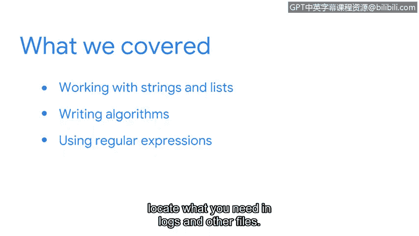

# 069：课程回顾与总结


在本节课中，我们将快速回顾并总结第七课所涵盖的所有核心概念。我们一起学习了如何操作字符串和列表、编写基础算法以及使用正则表达式，这些都是网络安全分析师处理数据和自动化任务的关键技能。

## 字符串与列表操作

上一节我们介绍了课程的整体目标，本节中我们来看看我们首先学习的内容：字符串和列表。

我们学习了专门用于处理这两种数据类型的方法。例如，使用`.upper()`方法将字符串转换为大写，或使用`.append()`方法向列表添加元素。

我们还学习了如何使用索引来定位和提取所需的信息。字符串和列表中的每个元素都有一个对应的位置编号，即索引，通常从0开始计数。

以下是处理字符串和列表时常用的几个操作示例：

*   **字符串方法**：`string.upper()`, `string.split()`
*   **列表方法**：`list.append()`, `list.index()`
*   **索引与切片**：`my_string[0]`, `my_list[1:4]`

## 算法编写

掌握了数据操作的基础后，我们进一步学习了如何编写简单的算法。

我们编写了一个从IP地址列表中提取网络ID的算法。这个过程涉及遍历列表、对每个字符串进行切片操作，并将结果组织起来。

以下是从IP地址`"192.168.1.10"`中提取前三个部分作为网络ID的核心代码逻辑：
```python
ip_address = "192.168.1.10"
network_id = ".".join(ip_address.split(".")[:3])  # 结果为 "192.168.1"
```

## 正则表达式



最后，我们探讨了功能强大的工具——正则表达式。

正则表达式允许你基于特定模式进行搜索，这极大地扩展了在日志文件或其他文本中定位所需信息的能力。例如，模式`\d{1,3}\.\d{1,3}\.\d{1,3}\.\d{1,3}`可以用来匹配一个IP地址。

这些概念较为复杂，你可以随时重温相关视频以加深理解。

## 总结与展望

本节课中我们一起学习了Python中处理字符串和列表的方法、编写基础算法的步骤，以及使用正则表达式进行模式匹配的技巧。


掌握这些概念，意味着你在处理安全数据、编写安全专业人员所需的算法方面迈出了一大步。在接下来的课程中，你将获得更多关于Python的实践机会，并深入了解它能为安全分析师提供的各种强大功能。