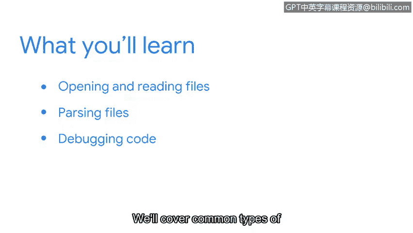

# 070：第四周导览

在本节课中，我们将学习如何将Python应用于实际的网络安全分析工作。我们将重点探讨如何处理安全日志文件，并学习如何调试代码以解决常见错误。

我们已经一起学习了Python的许多知识，但仍有更多内容需要探索。在本节中，我们将探讨像您这样的安全分析师如何将Python付诸实践。

作为一名安全分析师，您很可能会处理记录各种系统活动信息的安全日志。这些日志文件通常非常庞大，难以快速解读。但Python可以轻松地自动化这些任务，使工作变得更加高效。

因此，首先我们将重点学习如何在Python中打开和读取文件，这包括日志文件。之后，我们将探索如何解析文件。这意味着您将能够以特定的方式处理文件，从而获取您所关注的安全相关信息。

最后，编写代码的一部分工作是调试代码。能够解读错误信息以使您的代码正常运行，这一点非常重要。

我们将介绍常见的Python错误类型及其解决方法。总的来说，在完成本节学习后，您将对Python以及作为安全分析师如何运用它有更深入的理解。我迫不及待地想与您一同学习。