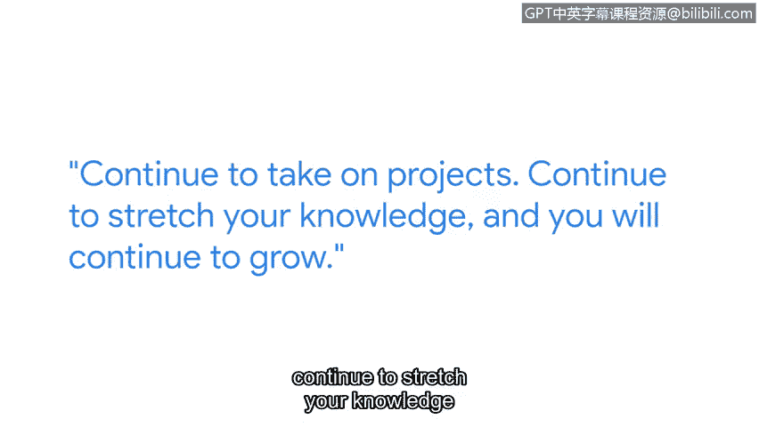

# 072：持续学习与Python应用

## 概述
在本节课中，我们将跟随谷歌高级安全工程师Clancy，了解他如何在实际工作中应用Python，以及他对网络安全领域持续学习的见解。我们将学习Python在网络安全自动化中的重要性，并获取初学者入门与成长的实用建议。

## 正文

我的名字是Clancy，我是一名高级安全工程师。

我在谷歌的团队是持续保护谷歌敏感信息工作的一部分。

我们每天的工作都涉及保护客户数据和个人身份信息，每天的工作内容都不同。

这份工作让我能够运用不同的技能和知识体系，没有哪两天是完全一样的。

严格来说，我并非工程师或软件工程师出身；我实际上学的是会计。

亲身经历过任何类型的网络安全攻击，无疑会让你从对立面获得深刻的视角。

你能看到这如何影响用户，如何影响遭受攻击的人们。

如果我刚开始职业生涯时就了解网络安全领域究竟有多么广阔，那本可以让我探索更多方向。

Python是一种开发语言，我在谷歌的岗位上非常频繁地使用它。

关于Python，我最喜欢的一点是这门语言的能力。你可以用它创建非常强大的脚本，用于日常工作中。

当我最初学习Python时，最棘手的部分是学会如何用“Pythonic”的方式表达想法。

我利用了各种在线资源、书籍，并着手进行一些副业项目。

Python最大的优点之一是一门被广泛使用的语言，你可以根据你的技能水平，在网上找到非常多的资源。

Python以及任何其他开发语言都在不断进化。

持续承担项目，持续拓展你的知识，你就能持续成长。

我能给刚开始学习Python的人的建议是：让它变得有趣。我认为一旦你发现学习一门语言是有趣的，它就能让你更投入。

建立对网络安全是什么的良好基础认知。

在开始时让自己涉猎广泛一些，变得全面，然后从那里出发，你可以深入钻研你感兴趣的主题。

刚开始时可能会非常艰难，你会感觉像是在爬一座大山。

请坚持下去，持续学习，这最终会是一段非常有回报的经历。

## 总结
本节课中，我们一起学习了Clancy分享的宝贵经验。我们了解到Python在自动化网络安全任务中的强大能力，以及以“Pythonic”方式思考的重要性。更重要的是，我们认识到在广阔的网络安全领域，建立广泛基础后深入专研，并通过持续学习和实践项目来保持成长，是获得成功和满足感的关键。记住，让学习过程充满乐趣是保持动力的最佳方式。