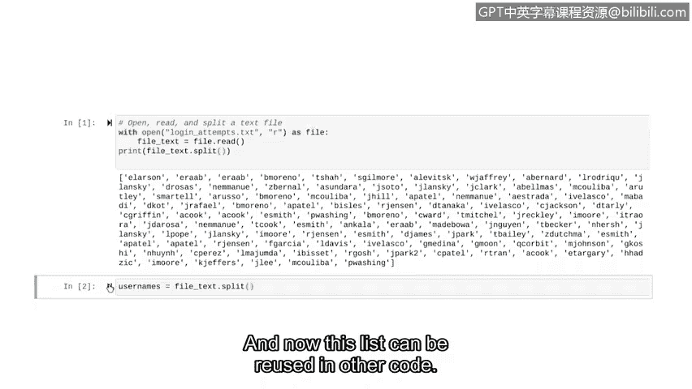
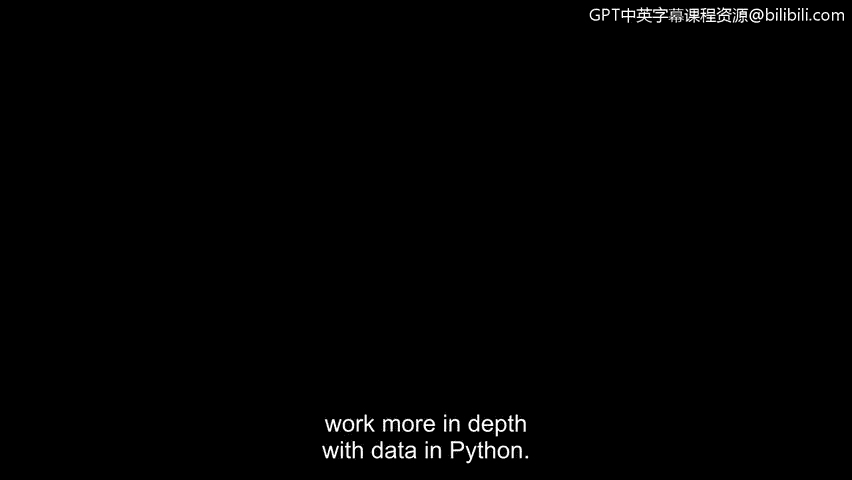

# 074：解析Python中的文本文件


在本节课程中，我们将学习如何解析文本文件。解析是将数据转换为更易读格式的过程。我们将结合之前学到的列表和字符串知识，并学习一个新的字符串方法，来为导入Python的文本文件赋予结构，以便于后续分析。

## 概述：从导入到解析

上一节我们介绍了如何将文本文件导入Python。本节中，我们将更进一步，学习如何解析这些文本数据，使其结构化。这将使我们能够更轻松地分析数据。

## 什么是解析？🔍

解析是将数据转换为更易读格式的过程。在Python中，我们经常需要处理来自日志文件、报告等的原始文本数据。通过解析，我们可以将这些大块的文本分解成有意义的、可单独处理的部分。

## 关键工具：`split()`方法

为了实现解析，我们需要使用字符串的 `split()` 方法。这个方法可以将一个字符串转换成一个列表。

`split()` 方法通过基于指定的分隔符来分割字符串。如果不传递任何参数，则默认在遇到**任何空白字符**（包括空格、换行符等）时进行分割。

其基本语法如下：
```python
字符串.split(分隔符)
```

例如，对于字符串 `"We are learning about parsing."`，使用 `split()` 方法：
```python
text = "We are learning about parsing."
word_list = text.split()
print(word_list)
```
输出结果将是：`['We', 'are', 'learning', 'about', 'parsing.']`

我们使用 `split()` 方法将字符串分割成更小的片段，这比分析一大块文本要容易得多。

## 实战演练：解析安全日志

在本视频的示例中，我们将处理一个安全日志文件，其中每一行代表一个新的数据点（例如一个用户名）。我们的目标是将这些数据点存储到一个列表中。

由于Python将换行符视为一种空白字符，我们可以直接使用不带参数的 `split()` 方法来基于每一行进行分割。

以下是操作步骤：

首先，我们复用上一节视频中用于打开文件并将其内容读入字符串的代码。
```python
with open(“update_log.txt”, “r”) as file:
    text = file.read()
```

现在，让我们使用 `split()` 方法将这个字符串分割成列表，并打印输出。
```python
print(text.split())
```

运行代码后，Python将输出一个用户名列表，而不是一个长长的、包含所有用户名的字符串。

如果我们需要保存这个列表以供后续使用，可以将其赋值给一个变量。
```python
usernames = text.split()
print(usernames)
```
现在，`usernames` 这个列表就可以在其他代码中重复使用了。




## 总结与展望 🎉

恭喜你！你刚刚学会了在Python中解析文本文件的基础知识。我们了解了**解析**的概念，并掌握了使用 `split()` 方法将字符串转换为结构化列表的核心技能。

在接下来的视频中，我们将探索更多技术，帮助我们在Python中更深入地进行数据处理。



