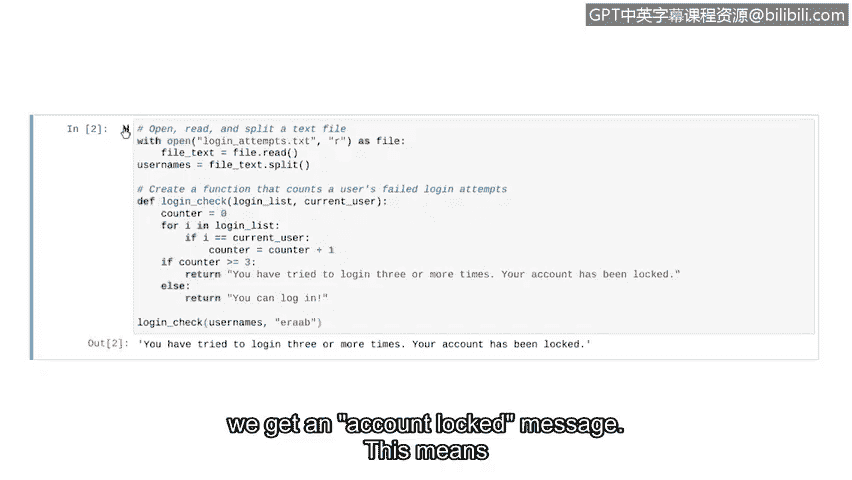

# 075：开发Python解析算法


在本节中，我们将整合之前学到的所有知识，学习如何导入文件、解析文件内容，并实现一个简单的算法来检测可疑的登录尝试。我们将创建一个程序，在每次新用户登录时运行，检查该用户是否有三次或更多次失败的登录尝试。

## 概述

我们将处理一个存储失败登录尝试的日志文件。该文件为TXT格式，每行包含一个用户名，每个用户名代表一次失败的登录尝试。我们的程序需要检查登录用户的用户名在该文件中出现的次数。如果次数达到或超过三次，程序将发出警报。

## 开发策略

首先，我们需要讨论输入数据的结构，以便制定程序开发策略。

我们的日志文件是一个TXT文件，其中每行包含一个用户名。每个用户名代表一次失败的登录尝试。因此，当用户尝试登录时，我们的程序需要检查其用户名在日志文件中出现的次数。如果该用户名重复出现三次或更多次，程序将返回警报。

## 导入与解析文件

我们将从导入日志文件、分割其内容并将其存储到变量中的代码开始。

以下是导入文件并存储用户名的代码：

```python
with open('login_attempts.txt', 'r') as file:
    usernames = file.read().splitlines()
```

让我们打印 `usernames` 变量以检查其内容：

```python
print(usernames)
```

运行这段代码后，我们将得到一个用户名列表。这正是我们所期望的。现在，`usernames` 变量已准备好用于我们的算法。

## 设计计数算法

现在，让我们设计一个策略来统计列表中用户名的出现次数。我们将从用户名列表的前八个元素开始分析。

我们注意到，在列表中，用户名 `eraab` 出现了两次。但如何让Python来计数呢？我们将实现一个 `for` 循环来遍历每个元素。

我们可以用一个箭头来表示循环变量。同时，我们定义一个从0开始的计数器变量。

我们的 `for` 循环从用户名 `elarson` 开始。对于每个元素，Python会问：这个元素是否等于字符串 `"eraab"`？如果答案是“是”，计数器加一；如果“否”，计数器保持不变。

由于 `elarson` 与 `eraab` 不同，计数器保持为0。然后我们移动到下一个元素。我们遇到了第一个 `eraab`，此时计数器增加1。再移动到下一个元素，我们又发现一个 `eraab`，因此计数器再次增加1。这意味着我们的计数器现在为2。我们将对列表的其余部分继续这个过程。

## 在Python中实现算法

在Python中解决这个问题将涉及一个 `for` 循环、一个计数器变量和一个 `if` 语句。

让我们回到代码中。我们将创建一个函数来统计用户的失败登录尝试次数。

首先，定义我们的函数。我们将其命名为 `login_check`。它接受两个参数：第一个是 `login_list`，用于存储失败登录尝试的列表；第二个是 `current_user`，用于表示当前登录的用户。

在这个函数内部，我们首先定义计数器变量并将其值设置为0。

接下来，我们开始一个 `for` 循环。使用 `i` 作为循环变量，遍历 `login_list`。换句话说，随着循环迭代，它将直接遍历列表中所有的失败登录尝试。

在 `for` 循环内部，我们开始 `if` 语句。`if` 语句检查我们的循环变量是否等于我们正在搜索的当前用户。如果这个条件为真，我们希望给计数器加一。

我们的算法几乎完成了。现在，我们只需要最后的 `if-else` 语句来打印警报。如果计数器累计达到或超过三次，我们需要告诉用户他们的账户已被锁定，因此无法登录。我们还将为可以登录的用户编写一个 `else` 语句。

我们的算法现已完成。

## 测试函数

让我们在一个示例用户名上尝试我们的新函数。我们可以从列表中提取几个用户名，并对它们测试我们的函数。

首先，使用列表中的第一个名字进行测试：

```python
login_check(usernames, 'elarson')
```

运行代码。根据我们的代码，该用户可以登录，因为他们的失败登录尝试次数少于三次。

现在，让我们回到用户 `eraab`。请记住，在我们失败登录尝试列表的前八个名字中，他们有两个条目。你认为他们能够登录吗？

当我们运行：



```python
login_check(usernames, 'eraab')
```

我们得到了“账户锁定”的消息。这意味着他们有三次或更多次失败的登录尝试。干得漂亮！你刚刚开发了第一个涉及日志的安全算法。

随着你技能的增长，你将学习如何使这个算法更高效。但目前这个解决方案运行良好。

## 总结


在本视频中，我们整合了迄今为止学到的所有知识，从列表操作到算法开发，再到文件解析。我们在构建一个可应用于安全环境的算法的过程中完成了这一切。