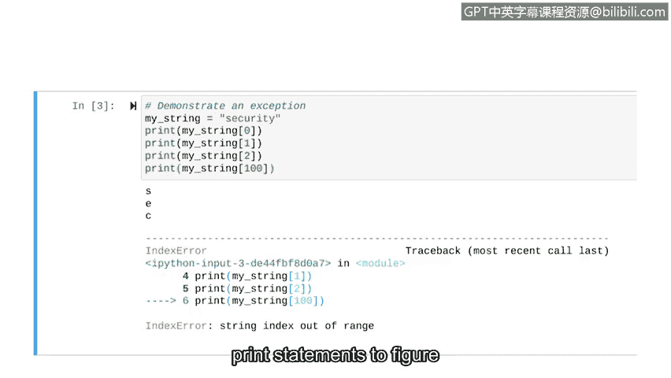

# 076：调试策略 🐛


在本节课中，我们将学习如何识别和修复Python代码中的错误，即调试。作为一名安全分析师，阅读或编写代码是常见任务，而让代码正确运行往往是一大挑战。掌握调试技能至关重要。

## 概述

调试是识别和修复代码错误的过程。代码错误主要分为三类：语法错误、逻辑错误和异常。我们将逐一探讨每种错误类型及其调试策略。

## 语法错误

上一节我们介绍了调试的重要性，本节中我们来看看第一种错误类型：语法错误。语法错误涉及Python语言的无效使用，例如在函数定义后忘记添加冒号。

**示例代码：**
```python
def greet_user(name)
    print("Hello, " + name)
```

运行此代码会收到指示语法错误的消息。错误信息通常会包含错误位置，这使得修复相对容易，类似于纠正邮件中的简单语法错误。

以下是常见的语法错误示例：
*   省略函数名后的括号。
*   拼错Python关键字（如将 `print` 写成 `prnt`）。
*   未正确闭合字符串的引号。

## 逻辑错误

接下来，我们关注逻辑错误。逻辑错误可能不会导致程序崩溃或显示错误信息，但会产生非预期的结果。例如，在 `print` 语句中写错文本，或在条件判断中使用 `<` 而非 `<=`，这可能导致关键值被错误地排除。

为了诊断难以发现的逻辑错误，可以采用以下策略：

**使用打印语句：**
在代码的关键位置插入打印语句，用于描述代码执行到了哪个部分（例如 `print("Line 20")`）。通过观察哪些打印语句按预期输出，可以定位出问题的代码段。

**使用调试器：**
调试器允许你在代码中设置断点，从而将代码分段并逐段运行。这与打印语句的思路类似，通过独立运行各个部分来隔离问题。

## 异常

最后，我们来了解异常。异常发生在程序语法正确但无法执行某段代码时。例如，进行数学上不可能的操作（如除以零），或访问不存在的列表索引。

**示例代码：**
```python
my_string = "security"
print(my_string[0])  # 输出 's'
print(my_string[1])  # 输出 'e'
print(my_string[100]) # 引发异常：IndexError: string index out of range
```

运行上述代码，前三个语句成功执行，但尝试访问索引100时，会抛出“字符串索引超出范围”的异常。对于异常，同样可以利用调试器和打印语句来定位潜在的错误源。



## 总结


本节课中我们一起学习了Python代码调试的三种主要错误类型：语法错误、逻辑错误和异常。我们探讨了各自的特征，并介绍了使用打印语句和调试器等策略来定位和修复问题。在Python编程中遇到错误和异常是正常的，关键在于掌握处理它们的方法，以确保编写的代码功能正常。