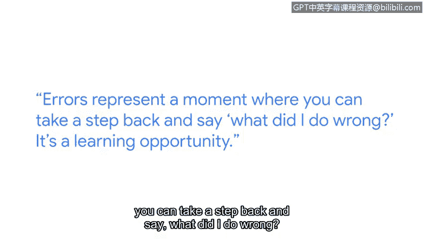

# 077：从错误中学习


## 概述
在本节课中，我们将跟随软件工程师Matt的分享，学习如何正确看待和处理编程与网络安全工作中的错误。我们将了解到，错误并非失败的标志，而是宝贵的学习机会。

## 从音乐到网络安全的旅程
上一节我们介绍了本课程的主题，本节中我们来看看Matt的个人经历。Matt在高中时梦想成为一名音乐家，专攻爵士长号。然而，他逐渐意识到乐队通常不会优先考虑长号手。与此同时，《黑客帝国》等电影激发了他对技术的兴趣，尽管电影情节并不完全反映真实的网络安全工作，但这种酷炫的形象为他提供了灵感。

## 重新认识编程错误
当我们开始学习编程时，常常会害怕错误。Matt最初也将代码错误视为自己能力不足的表现。但随着经验增长，他意识到每个人都会犯错，即使是最优秀的软件工程师也不例外。



关键在于转变视角：
*   **错误是学习机会**：错误提供了一个暂停和反思的契机，让你思考哪里出了问题。
*   **错误是探索的起点**：现在，Matt将错误视为深入了解问题、扩展计算机科学知识的时刻，这本身就是他工作的乐趣所在。

## 一个具体的错误案例：漏洞指纹识别
为了让大家更具体地理解，下面我们来看一个Matt在谷歌工作中遇到的棘手案例。在网络安全中，当发现一个系统漏洞后，如果后续又发现了相同的漏洞，安全团队不希望重复报告，以免给修复方造成困扰。

因此，他们采用了一种称为“指纹识别”的技术。其核心逻辑是：
```python
if vulnerability.fingerprint == existing_fingerprint:
    # 视为同一漏洞，不重复存储或处理
    treat_as_duplicate()
else:
    # 发现新漏洞，进行记录
    store_new_vulnerability()
```
Matt当时遇到了一个难题：某些漏洞没有按他预期的方式进行指纹匹配。他花费了数周时间苦苦思索，试图找出问题根源。最终找到解决方案的那一刻，他感到了巨大的满足。

## 面对困难时的建议
在深陷问题泥潭时，自我怀疑很容易滋生。你可能会质疑自己的能力。Matt想对曾经的自己，也是对所有初学者说两点：

首先，困境并非没有尽头，总会找到出路。解决问题的成就感是无与伦比的。

其次，适时寻求帮助是完全可行的。Matt始终倡导在遇到困难时主动求助。大多数人都会乐于帮助你，尤其是面对复杂问题时。

## 总结
本节课中我们一起学习了如何以积极的心态看待编程和网络安全工作中的错误。我们从Matt的职业生涯转变中获得了启发，明白了错误是成长和学习的一部分。通过具体的“漏洞指纹识别”案例，我们看到了解决复杂问题后的成就感。最后，我们记住了两个重要建议：坚持终会突破，并且要勇于寻求帮助。网络安全领域日新月异，充满挑战与机遇，正是投身其中的好时机。