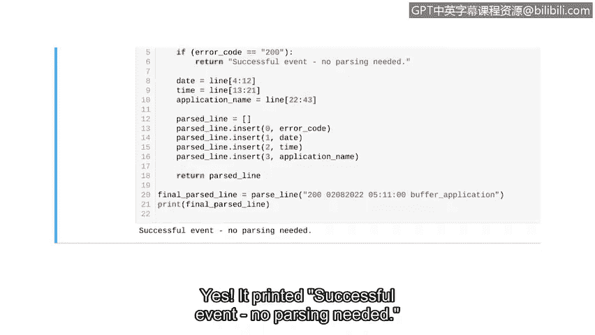

# 078：应用调试策略

在本节课中，我们将学习如何应用调试策略来修复一段存在问题的代码。我们将逐步识别并解决语法错误、异常和逻辑错误，最终确保代码按预期运行。

---

## 概述

我们将帮助同事调试一段代码，其功能是解析日志文件中的单行数据并返回结果。日志文件记录了软件应用的潜在问题，每行包含HTTP响应状态码、日期、时间和应用名称。代码需要跳过状态码为200（表示成功事件）的行，并返回无需解析的提示信息。

## 识别并修复语法错误

首先，我们需要运行代码以识别出现的错误。遇到的第一个错误是语法错误。

错误信息指出，语法错误发生在定义函数的那一行。函数定义的头部应以冒号结尾。我们添加冒号来修复此问题。

修复后，语法错误应消失。让我们再次运行代码。

## 处理名称异常

现在语法错误已修复，但我们遇到了另一个错误：名称错误。这是一种异常，意味着语法正确但Python无法处理该语句。

错误信息显示，解释器在将变量 `application name` 添加到解析列表时无法识别它。我们需要检查代码中该变量的定义部分。

问题在于变量名拼写错误。正确的变量名应为 `application_name`（包含下划线），而不是 `applicationname`。我们修正拼写。

修正后，再次运行代码。

## 检查并修复逻辑错误

现在，代码不再报错，但这并不意味着调试工作已完成。我们需要检查程序的逻辑是否按预期工作。

代码的输出是解析后的行。然而，根据需求，当状态码为200时，代码不应解析该行，而应打印“无需解析”的消息。但当前调用状态码为200时，并未显示此消息，这表明存在逻辑错误。

我们需要回到处理状态码200的条件语句部分进行调查。

为了定位问题，我们添加一些打印语句。我们在包含 `return parse_list` 的代码行前添加一个打印语句，在检查状态码是否为200的 `if` 语句前添加另一个，并在 `if` 语句内部再添加一个。

运行代码并查看打印输出。只有第一个打印语句有输出，另外两个没有。这说明程序甚至没有进入检查状态码200的 `if` 语句。

问题出在返回 `parse_list` 变量的代码行之前。当Python遇到第一个 `return` 语句时，它会立即退出函数，这意味着它在检查状态码是否为200之前就返回了结果。

为了修复这个问题，我们必须将检查状态码的 `if` 语句移到返回 `parse_list` 之前。

首先，我们删除之前添加的打印语句，以提高代码效率。然后，将 `if` 语句移到从行中解析出状态码的代码行之后。

现在，再次运行代码以确认问题已修复。代码成功打印了“成功事件，无需解析”的消息。

---

## 总结

本节课中，我们一起学习了应用调试策略。我们逐步修复了语法错误、名称异常和逻辑错误。通过添加打印语句定位问题，并调整代码执行顺序，最终确保了程序逻辑的正确性。希望这些策略能帮助你更有效地调试自己的代码。😊