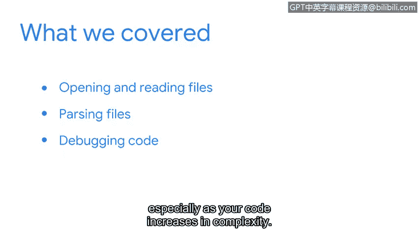

# 079：章节总结


在本节课中，我们将回顾第七课的核心内容，重点总结在网络安全实践中应用Python的几个关键新主题。

## 回顾核心主题 🎯

上一节我们介绍了Python在网络安全中的基础应用，本节中我们来看看几个能帮助你将Python付诸实践的新主题。

首先，我们探讨了在Python中打开和读取文件。网络安全分析师需要处理大量日志文件，因此掌握这项技能至关重要。

接下来，我们讲解了文件解析。日志文件通常非常冗长。因此，构建这些文件的结构以使其更具可读性，有助于你自动化任务并获取所需信息。以下是读取文件的基本代码示例：
```python
with open('logfile.txt', 'r') as file:
    content = file.read()
```

最后，我们重点介绍了代码调试。了解如何调试代码可以为你节省大量时间，尤其是在代码复杂度增加时。调试的核心是定位并修复错误，其通用流程可表示为：
**发现问题 -> 定位错误 -> 修复代码 -> 验证结果**



## 总结与展望 📝

总的来说，希望你对在本节中完成的学习内容感到自豪。通过Python解决安全问题令人振奋，而我们所涵盖的知识将使你具备这种能力。


本节课中我们一起学习了文件操作、文件解析和代码调试这三个关键技能。这些是使用Python自动化处理安全日志和分析数据的基础，为你后续应对更复杂的网络安全任务做好了准备。