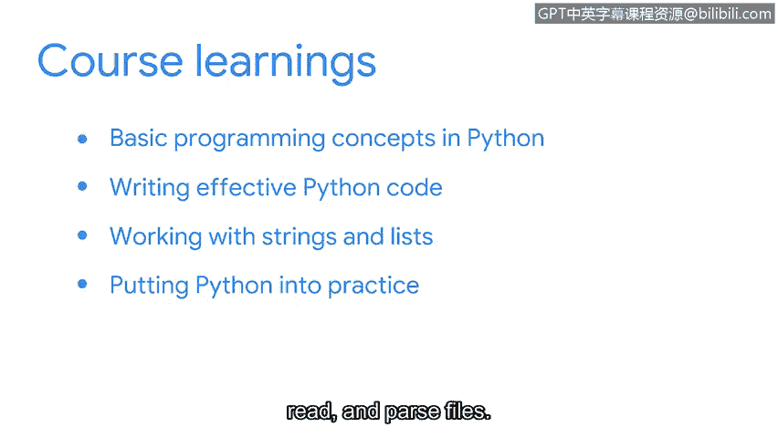

# 080：课程总结

在本节课中，我们将回顾整个课程的核心内容，总结在Python编程以及其在网络安全领域应用方面所学到的关键知识与技能。

---

## 🎓 课程回顾

随着本课程接近尾声，首先要祝贺你坚持学习了Python。探索这门在安全领域非常有用的编程语言，你应该感到很有成就感。

让我们简要回顾一下所学内容。

### 编程基础概念

首先，我们学习了Python的基本编程概念。我们讨论了**变量**、**数据类型**、**条件语句**和**循环语句**。这些主题为我们后续探索更深入的内容奠定了重要基础。

以下是我们在基础部分涵盖的核心概念：
*   **变量**：用于存储数据的容器。
*   **数据类型**：例如字符串（`str`）、整数（`int`）、列表（`list`）。
*   **条件语句**：使用 `if`、`elif`、`else` 来控制程序流程。
*   **循环语句**：使用 `for` 和 `while` 来重复执行代码块。

### 编写高效代码

接下来，我们的重点是编写高效的Python代码。我们学习了如何在程序中复用**函数**以提高效率。我们探索了如何构建函数，甚至创建了自己的**用户自定义函数**。

另一个重要主题是**模块**和**库**。它们包含的预打包函数和变量可以让我们的工作变得更轻松。最后，我们学习了确保代码可读性的方法。

### 处理字符串与列表

在下一部分，我们专注于处理**字符串**和**列表**。我们学习了可应用于这些数据类型的多种方法。我们还了解了它们的**索引**，以及如何从字符串中**切片**字符或从列表中**切片**元素。

我们将所有这些知识结合起来，编写了一个简单的算法。然后，我们探索了如何使用**正则表达式**在字符串中查找模式。

### Python实践应用

最后，我们以Python的实践应用作为课程的收尾。我们学习了如何**打开**、**读取**和**解析文件**。掌握这些技能后，你将能够处理在安全环境中遇到的各种日志文件。

我们还学习了如何**调试代码**。这是所有程序员都应掌握的一项重要技能。

---

## 🏆 总结与鼓励

你在这门课程中学到了很多关于Python的知识，做得非常出色。我希望不久之后，你能和我一起在安全专业领域中使用Python。

同时，我鼓励你多加练习，并随时可以重新观看这些视频。你对这些概念研究得越多，它们就会变得越容易。再次感谢你与我一同探索Python的世界。