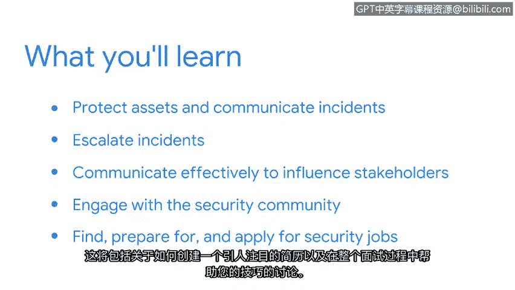

# 001：课程介绍 🛡️

## 概述

在本节课中，我们将学习如何将之前课程中掌握的核心安全概念付诸实践，为成为一名网络安全分析师做好准备。课程将涵盖资产保护、事件沟通、资源获取以及求职准备等关键环节。

## 课程内容

大家好，欢迎来到本课程。我是Dion，谷歌的一名项目经理。

过去五年，我一直在安全领域工作，涉足风险管理、内部威胁检测等多个方面。

我将担任本课程的第一位讲师。作为一名安全分析师，你将帮助保护你所服务组织的资产。

这些资产包括软件和网络设备等有形或物理资产。

也包括个人身份信息、版权和知识产权等无形资产。

想象一下，如果此类敏感信息被威胁行为者泄露，将对组织及其服务对象的声誉和财务稳定性造成毁灭性打击。

在之前的课程中，我们讨论了与安全职业相关的各种主题，包括核心安全概念、框架与控制、威胁、风险与漏洞、网络、事件检测与响应以及编程基础。

现在，是时候将这些核心安全概念投入实际应用了。在本课程中，我们将进一步探索如何保护资产和沟通事件。

接着，我们将讨论何时以及如何将事件上报，以保护组织的资产和数据。

之后，本课程第二部分的讲师Emily将介绍一些可靠的资源，帮助你在完成证书课程后与安全社区建立联系。最后，我们将讲解如何寻找、准备并申请安全领域的工作。这包括如何制作一份有吸引力的简历，以及在整个面试过程中为你提供帮助的技巧。

## 讲师分享与课程目标

当我开始第一份安全相关的工作时，我很兴奋能受雇于谷歌，负责保护信息和设备。

我也很高兴能成为一个更广泛团队的一员，可以向他们学习并在需要时寻求支持。

我的团队帮助我增长了专业知识，我为我在项目中的贡献感到自豪。

在本课程结束时，你将拥有多次机会来深化对关键安全概念的理解，创建简历，增强面试技能的信心，甚至参与一次人工智能生成的模拟面试。

安全专业是一个令人惊叹的领域，我期待你的加入。

我只有一个问题要问你：你准备好开始了吗？

## 总结

本节课我们一起了解了第八课的整体目标与结构，明确了将理论应用于实践、为实际网络安全工作做好准备的学习路径。从下节课开始，我们将深入具体的实践环节。