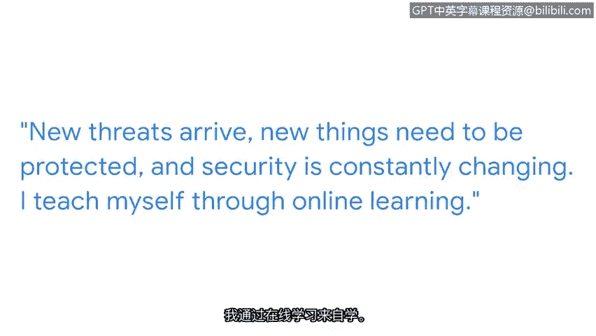

# 002：为网络安全工作做好准备

## 概述

在本节课中，我们将跟随谷歌项目经理迪昂，了解他进入网络安全领域的个人职业旅程。我们将学习他如何从其他行业转型，以及他作为安全专业人员应对挑战、持续学习的心得。这对于有志于进入网络安全领域的学习者具有重要的启发意义。

---

## 1. 迪昂：我的个人职业之旅

大家好，我是迪昂。我是谷歌的一名项目经理。我隶属于检测与响应团队，该团队属于隐私、安全与保障组织。

### 1.1 工作的核心价值

我最喜欢工作的部分是，理解我们每天都会遇到各种威胁，而我的团队能帮助确保我们发现这些威胁并做出相应的响应。

网络安全至关重要。正如我们需要保障自身的人身安全一样，我们也需要确保我们在线上的信息安全无虞。因此，每当你使用电脑或设备时，你的数据就存在于网络的某个地方。你信任谷歌和其他公司来保护这些数据，并确保其仅对你个人私密。

我每天所做的工作，就是确保你的信息、你的数据以及全世界的资讯保持安全、私密并受到保护。

### 1.2 职业转型之路

在涉足网络安全领域之前，我曾在不同领域担任过许多工作。其中之一是担任电台DJ和网络主播，这与安全领域关系不大。但我从中获得的一个关键启示是：**无论发生什么，都要让音乐继续播放**。

同时，我也是一位自豪的父亲。我的孩子们是我最宝贵的财富，我必须保护他们。作为一个安全从业者，我深知他们面临着诸多威胁和风险，甚至存在弱点。同样，我也必须保护我所负责的信息，使其免受威胁、风险和漏洞的侵害。

### 1.3 安全专业人员的日常

作为一名安全专业人员，总会遇到突发状况。你必须找到方法让事情继续推进。无论是将问题上报给正确的团队，还是沿着指挥链向上汇报以寻求解决方案。

由于没有接受过正规的安全培训，我的任务是每天自学新知识。新的威胁会出现，新的事物需要保护，安全领域也在不断变化。

### 1.4 持续学习的方法

我通过在线学习来自我提升，订阅并阅读大量与安全知识相关的期刊，同时也在线上学习一些安全课程。

### 1.5 给初学者的建议

我认为，对于安全领域的初级职位而言，最具挑战性的部分是 **“不知道自己不知道什么”**。当我最初接触安全领域时，我真的是在摸索中前进。但我始终坚持的一点是，随时向我的团队寻求支持。

遇到困难是过程的一部分，我们总是可以依靠团队和其他人来获得额外的支持，或者帮助我们摆脱困境。

---

## 总结

本节课中，我们一起学习了迪昂从其他行业成功转型为网络安全项目经理的经历。我们了解到网络安全工作的核心价值在于保护信息，认识到持续学习和团队协作在应对未知挑战时的重要性。迪昂的经历告诉我们，即使没有科班背景，通过主动学习、积极求助和保持韧性，也能在网络安全领域建立成功的职业生涯。