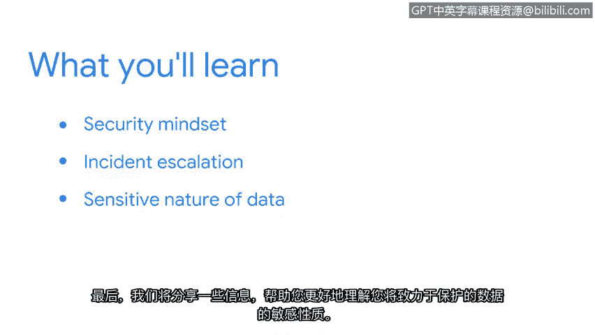

# 003：欢迎来到第一周

在本节课中，我们将要学习如何培养安全思维，并运用这种思维来保护组织的资产与数据。我们还将探讨发生安全事件时的上报流程，并理解待保护数据的敏感性。

## 培养安全思维

上一段我们概述了本周的学习目标，本节中我们来看看什么是安全思维。安全思维是一种主动识别潜在风险并采取措施预防安全事件的思考方式。拥有安全思维意味着始终对可能威胁组织资产和数据的行为保持警惕。

## 保护组织与人员

在理解了安全思维的核心后，本节我们将探讨如何运用它来提供保护。安全专业人员的目标是保护组织及其所服务的人员。这涉及到保护多种类型的资产。

以下是需要保护的主要资产类别：

*   **物理资产**：例如建筑物、服务器和硬件设备。
*   **网络资产**：例如内部网络、云基础设施和数字信息。
*   **数据资产**：例如客户个人信息、财务记录和知识产权。

## 安全事件上报流程

即使采取了预防措施，安全事件仍可能发生。因此，了解在发生安全漏洞时应采取的措施至关重要。事件上报是一个将安全事件信息传递给组织内适当团队或人员的过程，以确保事件得到及时有效的处理。

## 理解数据的敏感性

最后，为了有效地保护数据，我们必须理解其敏感性质。不同数据具有不同的敏感级别，需要相应级别的保护措施。处理数据时，必须遵守相关的法律、法规和道德准则。

本节课中我们一起学习了安全思维的基础、如何运用它来保护各类资产、安全事件发生时的上报流程，以及理解数据敏感性的重要性。这些是网络安全实践工作的核心基础。