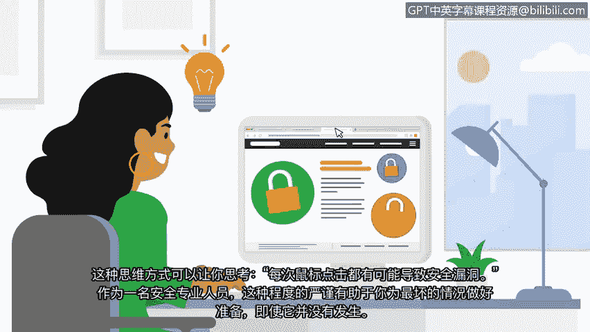

# 004：安全心态 🧠

在本节课中，我们将要学习一个贯穿整个网络安全职业生涯的核心概念：**安全心态**。我们将探讨其定义、重要性以及如何培养和应用这种思维方式来识别和防御潜在威胁。

---

在之前的课程中，我们讨论了各种威胁、风险和漏洞，以及它们如何影响组织的运营及其服务的人群。这些概念是构建安全心态的关键考量因素。

拥有安全心态，意味着你不仅要清楚自己需要**防御什么**，更要明白自己是在**防御谁或什么**。例如，识别出对维持组织业务功能至关重要的资产类型，以及可能对这些资产产生负面影响的威胁、风险和漏洞类型，是至关重要的。这正是安全心态的核心所在。

**安全心态**是一种评估风险，并持续寻找、识别系统、应用程序或数据潜在或实际漏洞的能力。

---

上一节我们介绍了安全心态的基本定义，本节中我们来看看它在实际攻击场景中的应用。在课程中，我们讨论过由社会工程学攻击（如网络钓鱼）带来的威胁、风险和漏洞。这类攻击旨在破坏组织资产，以帮助威胁行为者获取敏感信息。

运用我们的安全心态，有助于预防此类攻击。我们必须持续关注正在发生的各类攻击动态。为此，养成一个习惯，主动搜寻关于最新安全趋势或漏洞的信息，是非常有益的。在这个过程中，保护公司数据的新想法可能会应运而生。

安全是行业内每个安全团队的日常目标。因此，拥有安全心态能帮助分析师抵御来自攻击者的持续压力。这种心态会让你认为，鼠标的每一次点击都有可能引发一次安全漏洞。

---

作为安全专业人员，这种严谨的审视态度能帮助你为最坏的情况做好准备，即使它并未发生。初级分析师可以帮助保护各种级别的资产。

以下是不同级别资产的例子：
*   **低级别资产**：例如组织的访客Wi-Fi网络。
*   **高级别资产**：例如知识产权、商业秘密、个人身份信息（PII）乃至财务信息。

你的安全心态使你能够保护所有级别的资产。然而，如果事件确实发生，这并不意味着你需要以同样的方式应对所有事件。我们将在课程稍后部分讨论事件优先级排序。

---

当你准备进入安全行业时，拥有强大的安全心态可以帮助你从其他候选人中脱颖而出。在未来的工作面试中提及这一基础，甚至可能是一个好主意。我们将在课程后面详细讨论面试准备。

接下来，我们将更详细地关注**事件检测**。

---

本节课中，我们一起学习了**安全心态**。我们了解到，它是一种主动评估风险、识别潜在威胁的思维方式，对于保护从访客网络到核心机密在内的所有级别资产都至关重要。培养这种心态，不仅能有效防御攻击，也是你在网络安全职业道路上脱颖而出的关键。