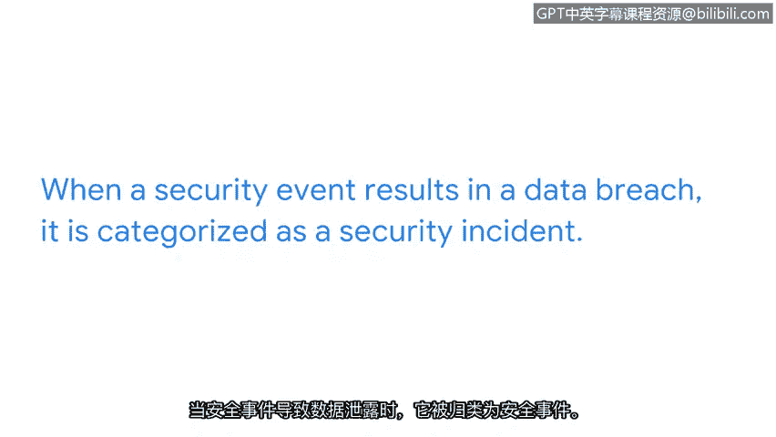

# 005：在不忽视的情况下进行检测和保护

## 概述
在本节课中，我们将要学习如何在实际工作中检测和保护组织的关键数据与资产，理解安全事件的影响，并明确安全专业人员的职责与协作的重要性。

## 课程内容

上一节我们讨论了安全事件对组织关键数据和资产的潜在影响。本节中我们来看看如何在实际工作中进行有效的检测和保护。

如果数据和资产遭到破坏，可能导致组织蒙受经济损失，甚至引发监管罚款，并损害其在客户或同行业其他企业中的信誉。因此，您在保护公司数据和资产方面的角色至关重要。

协作是安全工作中令人兴奋的一部分。组织中有许多人对安全的各项功能感兴趣。没有安全专业人员可以独自完成这项工作。有些团队成员专注于保护敏感的财务数据，有些则致力于保护用户名和密码，还有些人更关注保护第三方供应商的安全，另一些人可能关心保护员工的个人身份信息。这些利益相关者都关注安全团队在保护组织及其服务对象免受恶意攻击方面所扮演的角色。

认识到您所保护的资产和数据会影响组织的多个层面，这一点非常重要。组织最关心的问题之一是客户数据的保护。客户相信与其互动的组织会始终保护他们的数据。这包括信用卡号、社会安全号码、电子邮件、用户名、密码等等。在承担安全角色时，牢记这一点至关重要。理解您所保护数据的重要性，是拥有强大安全思维的重要组成部分。

作为安全专业人员，谨慎处理敏感数据非常重要。同时要关注细节，确保私人数据免受泄露。当安全事件导致数据泄露时，它被归类为安全事件。然而，如果事件在未导致泄露的情况下得到解决，则不被视为事件。

在安全领域工作时，最好保持谨慎。这意味着要关注细节，并将问题上报给主管。例如，一个看似小的问题，比如员工未经服务台许可在工作设备上安装应用程序，也应该上报给主管。这是因为某些应用程序存在漏洞，可能对组织的安全构成威胁。一个更大的问题的例子是，注意到日志中可能执行了恶意代码。恶意代码可能导致运营中断、严重的财务后果或关键高级资产的损失。关键在于，没有太小或太大的问题。如果您不确定事件的潜在影响，最好保持谨慎，并向适当的团队成员报告。

每天作为安全专业人员的工作都伴随着帮助保护组织及其人员的责任。您所做的决定不仅影响公司，还影响其客户和组织内无数的团队成员。请记住，您的工作至关重要。

## 总结
本节课中我们一起学习了安全专业人员在日常工作中检测和保护组织资产的核心职责。我们明确了安全事件与数据泄露的关系，理解了协作的重要性，并认识到无论问题大小，保持警惕和及时上报是保护组织免受威胁的关键。您的决策和行动对组织的安全至关重要。