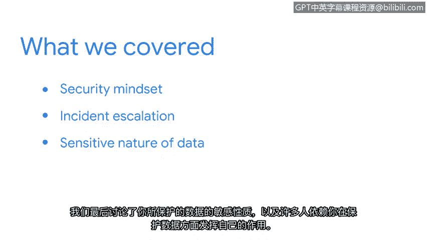

# 006：总结与回顾

在本节课中，我们探讨了初级安全分析师在保护组织数据和资产方面所扮演的重要角色。现在，让我们对所学内容进行总结。

## 课程内容回顾

上一节我们介绍了安全分析师的核心职责，本节中我们来快速回顾一下本课涵盖的关键知识点。

以下是本课讨论的主要议题：

*   **安全思维的重要性**：我们首先讨论了拥有安全思维的重要性，包括它如何支持安全事件的检测。
*   **事件与事故的关系**：接着，我们审视了安全事件与安全事故之间的关系，并进一步探讨了安全事故的升级流程。
*   **保护数据的责任**：最后，我们探讨了所保护数据的敏感性，以及有多少人依赖你履行保护这些数据的职责。

## 个人价值与团队贡献

理解你作为安全团队一员的价值，有助于你正确看待自己所做的工作。安全领域的每一条规则都至关重要。公式可以表示为：**团队整体安全 = 每个成员贡献的总和**。每一位成员都为公司运营的顺畅进行贡献着力量。

## 总结与展望

本节课中，我们一起学习了初级安全分析师的核心角色、安全思维、事件处理流程以及保护数据的重要责任。希望你对我们的讨论感到有所收获。

你是否准备好继续在安全世界的探索旅程？接下来，我们将讨论安全事故升级的重要性。