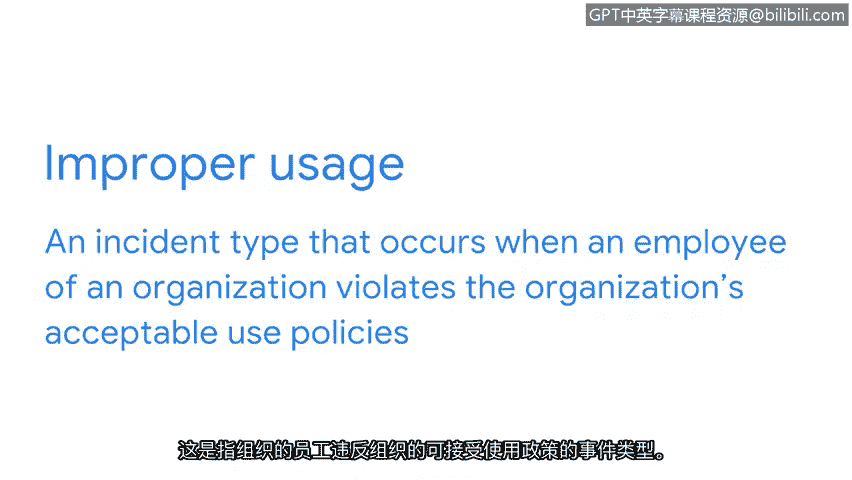

# 009：准备通过安全认知进行升级 🔒

在本节课程中，我们将学习几种需要重点关注的网络安全事件分类。理解这些事件类型是有效上报和处理安全事件的基础。

## 概述

之前，我们定义了“事件升级”的含义，并讨论了在需要时正确升级事件所需的技能。本节中，我们将具体了解三种关键的安全事件分类：恶意软件感染、未经授权的访问和不当使用。

## 恶意软件感染

恶意软件感染是指旨在破坏系统的恶意软件侵入组织计算机或网络时发生的事件类型。

正如之前课程所讨论的，恶意软件感染有多种形式。有些较为简单，有些则更为复杂。一个简单的例子是网络钓鱼攻击。一个更复杂的例子是勒索软件攻击。恶意软件感染可能导致系统网络运行速度异常缓慢。攻击者甚至可能阻止组织查看关键数据，除非组织向攻击者支付赎金以解锁数据。

由于组织网络和计算机上存储着大量敏感数据，此类事件对组织的影响尤为严重。因此，上报恶意软件感染是保护你所服务组织的重要环节。

## 未经授权的访问

接下来，我们讨论第二种事件类型：未经授权的访问。

当个人未经许可获得对系统或应用程序的数字或物理访问权限时，就会发生此类事件。

你可能还记得，在本课程计划的早期，我们讨论过暴力破解攻击。这种攻击通过反复试验来破解密码、登录凭证和加密密钥。这些攻击常被攻击者用来获取对组织系统或应用程序的未经授权访问。

所有未经授权的访问事件都需要上报。然而，上报的紧急程度取决于该系统对组织业务运营的关键性。我们将在本课程后面更详细地探讨这个概念。

## 不当使用

我们将讨论的第三种事件是不当使用。

当组织的员工违反组织的可接受使用政策时，就会发生此类事件。

这种情况可能有些复杂。有些不当使用事件是无意的。例如，员工可能试图访问软件许可证供个人使用，甚至使用公司系统访问朋友或同事的数据。也许员工没有意识到他们违反了政策，或者政策本身没有明确定义并传达给员工。

但也有一些时候，不当使用是故意行为。那么，如何判断不当使用事件是意外还是故意的呢？这可能是一个难以做出的决定。因此，不当使用事件应始终上报给主管。

作为组织安全团队的成员，你在工作中很可能会遇到各种各样的事件类型。因此，了解它们是什么以及如何上报至关重要。

## 总结

本节课我们一起学习了三种核心的网络安全事件分类：**恶意软件感染**、**未经授权的访问**和**不当使用**。理解这些事件的定义、影响和上报原则，是构建有效安全事件响应流程的关键一步。在后续课程中，我们将深入探讨如何根据事件的严重性和紧急性来决定上报的优先级。