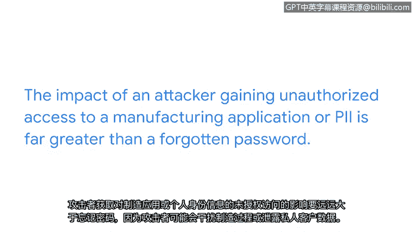

# 010：从简单活动到重大数据泄漏 📈

## 概述

在本节课程中，我们将探讨一个核心概念：如果安全事件未能被及时上报和处理，即使是最微小的异常活动，也可能最终演变成对组织造成重大损失的数据泄露事件。我们将通过一个具体的场景来理解资产、事件严重性与上报时机之间的关系。

---

## 事件升级的重要性

上一节我们讨论了不同类型的安全事件。本节中，我们来看看如果事件未能得到及时上报，可能会产生怎样的连锁反应。

安全团队度过了平静的一天。突然，你注意到一个近期已被组织禁止使用的应用程序出现了异常的日志活动。你打算在下次与主管的会议中提及此事，但后来忘记了，始终没有上报。

---

## 场景推演：一周之后

让我们将时间快进到一周后。你再次与主管会面。但此时，主管指出组织已经发生了一起数据泄露事件。

这次泄露影响了组织的一个制造工厂。现在，该制造工厂的所有运营都已暂停。这导致公司损失了资金和宝贵的时间。

数日后，安全团队发现，此次数据泄露最初正是源于那个已被禁止使用的应用程序中的可疑活动。

---

## 核心教训与事件严重性

从这个场景中我们学到的教训是：一个简单的事件，如果未能被妥善上报，可能导致严重得多的问题。

此处还需注意事件的**严重性**。最初，如果分析师没有足够信息来确定事件对组织造成的损害程度，可以将其以**中等**严重性上报。一旦经验丰富的事件处理人员审查了该事件，其严重性等级可能会被**调高**或**调低**。

你遇到的每一个安全事件对组织都重要，但有些事件无疑比其他事件更紧急。

---

## 如何判断事件的紧急程度？

那么，判断安全事件紧急程度的最佳方式是什么？这实际上取决于事件所影响的**资产**。

以下是几个例子，说明不同资产如何影响事件严重性：

*   **低影响资产示例**：如果员工忘记了工作电脑的登录密码，并多次尝试登录失败，可能会触发一个低级别的安全事件。此事件需要处理，但其影响可能微乎其微。
*   **高影响资产示例**：某些资产对组织的业务运营至关重要，例如制造工厂或存储**PII**的数据库。这类资产需要更高级别的紧急保护。

攻击者未经授权访问制造应用程序或PII所造成的影响，远比忘记密码严重得多。因为攻击者可能干扰制造流程，或泄露客户的私人数据。

---

## 总结

本节课中，我们一起学习了资产与安全事件之间的紧密关联。我们通过一个从异常日志活动演变为全面数据泄露的案例，理解了及时上报和准确评估事件严重性的至关重要性。记住，你的角色在早期识别和上报潜在威胁的过程中至关重要。在后续课程中，我们将分享更多与上报时机相关的新概念。