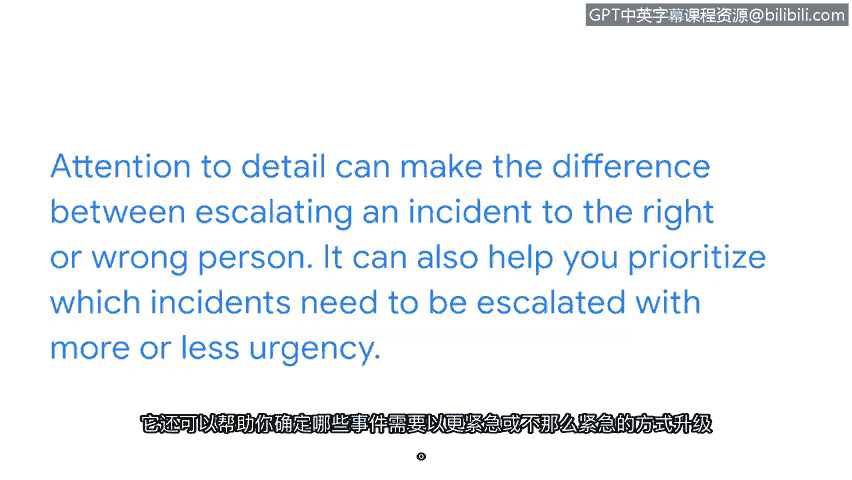

**谷歌网络安全专业证书：第八课：投入实践：为网络安全工作做好准备**

**P11：10_何时以及如何升级安全事件**

---

### **概述**

在本节中，我们将学习安全事件升级的具体步骤和通用准则。理解并遵循组织的升级策略，是安全分析师有效履行职责、保护组织免受威胁的关键。

---

我们已经探讨了您在事件升级过程中的角色重要性，也讨论了几种可能遇到的事件类型。但是，要正确升级一个事件，具体需要采取哪些步骤呢？

这个问题的答案实际上取决于您所服务的组织。并不存在一个所有组织都通用的、固定的标准或流程。每个安全团队在处理事件时，都有自己独特的流程和程序。

在本视频中，我们将讨论事件升级的通用准则，以及如何在工作中应用它们。让我们开始吧。

---

### **理解升级策略**

每个组织都有自己处理安全事件的流程。这个流程被称为**升级策略**，它是一套规定了当发生事件警报时应通知谁、以及应如何处理该事件的操作指南。

理想情况下，升级过程每次都应顺利进行。但在实际工作环境中，这个过程可能会遇到意想不到的挑战。例如，如果您的直属主管当天不在办公室，而事件又发生了，那么事件仍然需要升级给其他人处理。这个例子说明了理解组织升级策略的重要性。

您无需死记硬背组织的升级策略，但明智的做法是在工作设备上保存一个书签。这样，您就能在需要时随时查阅。

---

### **遵循升级策略的重要性**

遵循组织的升级策略至关重要，因为您所采取的行动有助于保护组织及其服务对象免受恶意行为者的侵害。一个组织的升级策略可能是一份内容广泛的文档。

因此，您需要关注组织升级策略中的细节。对细节的关注，决定了您是将事件升级给了正确的人还是错误的人。它还能帮助您确定哪些事件需要更紧急或较不紧急地升级。

---

### **应用通用准则**

每个组织处理事件升级的方式都不同，但分析师需要确保事件得到正确处理。以下是一些通用的指导原则，可帮助您在实际工作中应用升级策略：

1.  **确认事件**：首先，确认警报是真实的安全事件，而非误报。
2.  **初步评估**：根据事件的类型、影响范围和潜在风险进行初步评估。
3.  **查阅策略**：立即查阅组织的升级策略文档，确定当前的响应级别和应通知的人员。
4.  **执行通知**：按照策略规定，通过指定渠道（如工单系统、即时通讯、电话）通知相关人员。
5.  **记录行动**：详细记录您采取的所有步骤、通知的人员以及他们的响应，这对于事后分析和合规性至关重要。
6.  **跟进与协作**：在将事件升级后，保持与响应团队的沟通，根据需要提供进一步信息或协助。

---

### **总结**

本节课中，我们一起学习了安全事件升级的核心概念。我们了解到，升级没有固定标准，而是依赖于组织的特定**升级策略**。我们强调了遵循该策略、关注细节的重要性，并掌握了一套通用的升级步骤，以确保您能在各种工作场景中，正确、及时地将安全事件上报给合适的团队进行处理。出色的工作，您的安全思维正在不断拓展。😊