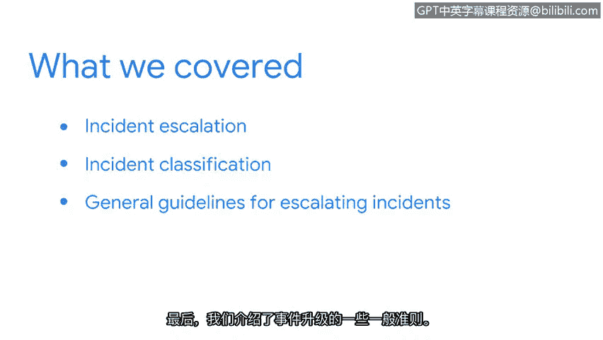

**网络安全职业准备：第八课：总结**

在本节课程中，我们学习了事件升级在网络安全中的核心作用。现在，让我们回顾一下所涵盖的关键内容。

我们首先定义了**事件升级**，并讨论了有效执行升级所需的重要特质。随后，我们探讨了几种**事件分类类型**及其对组织的潜在影响。

在此基础上，我们分析了如果处理不当，小的安全事件如何可能演变成更大的问题。最后，我们介绍了在实际进行事件升级过程中应遵循的一些通用准则。

需要注意的是，具体的升级流程会因您所在组织的不同而有所差异，但有一点应始终保持不变：**您对细节的关注**。

理解每个事件如何影响组织的数据和资产至关重要，因为您所做的决策可能会影响整个安全团队乃至整个组织。

您准备好继续您的安全之旅了吗？接下来，我们将讨论利益相关者以及如何与他们进行有效沟通。

在本节课中，我们一起学习了事件升级的定义、重要性、分类、潜在影响以及基本流程准则，为在实际工作中妥善处理安全事件奠定了基础。