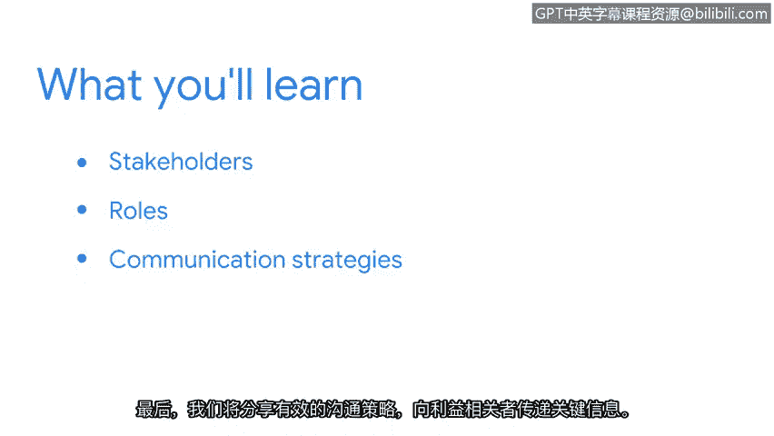

# 013：与利益相关者沟通

在本节课中，我们将学习如何识别网络安全工作中的关键利益相关者，并掌握与他们进行有效沟通的策略。理解并满足利益相关者的需求，是安全专业人员日常工作的核心部分。

## 概述

在之前的课程中，我们已经涵盖了大量内容，从安全基础到对网络以及SQL和Python等编程语言的基本理解。这些概念是准备担任安全专业角色的核心知识。但这些信息如何在日常工作中帮助你？你又需要向谁传达这些信息？在本课程中，我们将首先讨论利益相关者是谁。接着，我们将识别他们在安全领域中的角色。最后，我们将分享向利益相关者传达关键信息的有效沟通策略。

## 识别利益相关者

但在我们能与利益相关者沟通之前，我们必须先理解他们是谁以及他们为何重要。利益相关者是指任何会受到组织安全决策和事件影响，或能对其产生影响的人或团体。

以下是组织中常见的关键利益相关者类型：

*   **高层管理人员**：例如首席执行官、首席财务官，他们关注安全风险对业务目标和财务的总体影响。
*   **IT与运维团队**：负责维护系统、网络和应用程序，是安全措施的直接实施者。
*   **法律与合规部门**：关注安全实践是否符合法律法规及行业标准。
*   **最终用户/员工**：安全策略和工具的直接使用者，他们的行为直接影响安全态势。
*   **客户与合作伙伴**：其数据受到保护，并依赖组织的安全来保障业务连续性。

## 利益相关者在安全中的角色

上一节我们介绍了不同类型的利益相关者，本节中我们来看看他们在安全事务中各自扮演的具体角色。理解这些角色有助于我们明确沟通的重点和方式。

每个利益相关者群体对安全都有不同的视角和优先级：

*   **高层管理**：角色是**决策者与资源提供者**。他们需要了解安全投资与业务风险之间的平衡。
*   **IT/运维团队**：角色是**执行者与实施者**。他们需要清晰、可行的技术指导来落实安全控制。
*   **法律/合规部门**：角色是**监督者与顾问**。他们确保安全流程符合`GDPR`、`HIPAA`等法规要求。
*   **最终用户**：角色是**第一道防线**。他们需要明白安全政策的原因以及如何正确执行，例如创建强密码（`密码长度 >= 12`）。
*   **客户**：角色是**受影响方与信任赋予者**。他们需要确信其数据安全，这关系到组织的声誉。

## 有效的沟通策略

了解了利益相关者及其角色后，接下来的关键是如何与他们沟通。有效的沟通是连接技术细节与业务需求的桥梁。

以下是针对不同利益相关者的沟通策略要点：

*   **对高层管理**：沟通应简洁、聚焦业务影响。使用非技术语言，将安全事件或需求与财务、声誉和战略风险挂钩。例如：“此漏洞可能导致数据泄露，预计财务损失约为`X`元。”
*   **对IT/运维团队**：沟通需具体、技术化并提供操作细节。应包含明确的步骤、工具命令（例如：`sudo firewall-cmd --permanent --add-port=443/tcp`）和回滚方案。
*   **对法律/合规部门**：沟通要引用具体的法规条款和合规框架。明确说明当前状况与`ISO 27001`标准或某法律第`X`条的差距及弥补措施。
*   **对最终用户**：沟通要简单、直观且有教育意义。使用清晰的指引、图示和正面激励，避免使用恐吓性语言。例如，通过简短视频教程展示如何识别钓鱼邮件。
*   **通用原则**：无论对谁，都应**主动沟通**、保持**透明**、根据对方的知识水平调整**术语**，并确保信息**及时**。

## 总结

本节课中，我们一起学习了网络安全工作中与利益相关者沟通的核心要点。我们首先定义了谁是利益相关者及其重要性，然后分析了不同利益相关者在安全领域中的独特角色，最后探讨了针对这些角色采取的有效沟通策略。记住，将技术信息转化为对受众有意义的内容，是安全专业人员的一项关键技能。