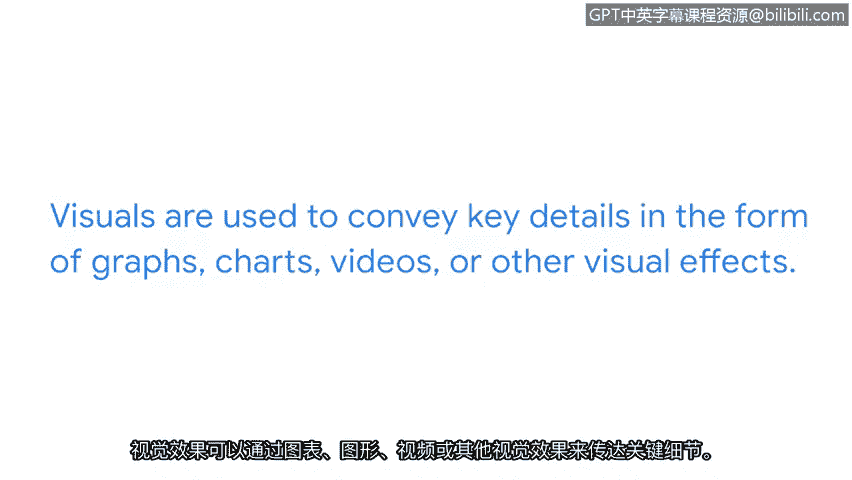

# 016：网络安全沟通的基本要素 🛡️

在本节课中，我们将学习如何为利益相关者创建精确、清晰的网络安全沟通。有效的沟通能确保利益相关者理解当前状况以及可能需要采取的行动。

## 概述

上一节我们讨论了向利益相关者传达重要信息。本节中，我们将深入探讨如何创建精确且清晰的沟通内容。

## 构建安全故事 📖

创建与利益相关者分享的安全通信，类似于讲述一个精彩的故事。故事通常有开头、中间和结尾，其中包含某种冲突及最终的解决方案。向利益相关者讲述安全故事时，这一概念同样适用。

安全故事详细说明了安全挑战是什么、它如何影响组织以及该问题的可能解决方案。这个故事还应包含与挑战、其影响及建议解决方案相关的数据。这些数据可以是总结关键发现的报告形式，也可能是需要立即关注的问题列表。

## 沟通场景示例

让我们使用以下场景作为示例。你一直在监控系统日志，并注意到日志中可能存在恶意代码执行，这可能导致敏感用户信息泄露。现在你需要将正在发生的事情传达给利益相关者，在本例中是你的直属主管。

以下是构建沟通的步骤：

*   **第一步：详述问题。** 说明在监控日志时发现的潜在恶意代码执行。
*   **第二步：参考组织规程。** 提及组织事件响应预案中关于在系统日志中发现恶意代码的建议指导。这向你的主管表明你一直在关注团队已建立的程序。
*   **第三步：提供可能的解决方案。** 讲述你故事的最后一个部分是为问题提供一个可能的解决方案。在此场景中，你可能不是关于采取何种行动的最终决策者，但你已经向利益相关者解释了发生的事情以及一个可能的解决方案。

## 沟通方式与工具

你可以通过多种方式传达我们刚刚讨论的故事。可以发送电子邮件、共享文档，甚至通过使用视觉呈现来进行沟通。你也可以使用事件管理或工单系统。许多组织拥有遵循其安全预案中概述步骤的事件管理或工单系统。

某些场景通过使用视觉元素能更好地表达。视觉效果用于以图表、图形、视频或其他视觉效果的形式传达关键细节。这允许利益相关者查看所解释内容的图示表示。视觉仪表板可以帮助你向利益相关者讲述一个完整的安全故事。在本课程后面，你将有机会学习如何使用 Google Sheets 创建视觉化的安全故事。

## 总结

一个知道如何讲述引人注目且简洁的安全故事的安全专业人员，可以帮助利益相关者就应对事件的最佳方式做出决策。理想情况下，你希望成为让利益相关者工作更轻松的人。而有效沟通无疑将帮助你做到这一点。接下来，我们将继续讨论与利益相关者的沟通。