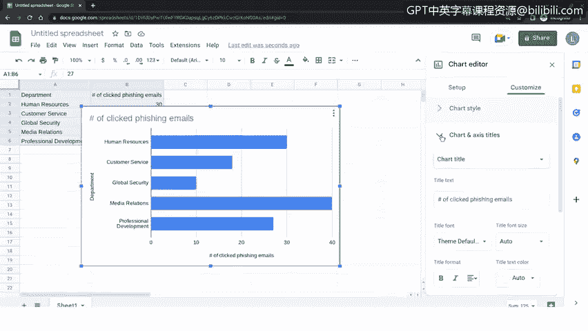

# 018：如何创建视觉仪表板 📊

在本视频中，我们将学习如何创建一个可视化的安全数据故事。我们将使用一个具体的场景，通过图表将关键信息安全数据直观地呈现给利益相关者，以便共同制定解决方案。

## 场景设定与目标 🎯

上一节我们讨论了与利益相关者沟通的重要性，本节中我们来看看如何将数据转化为直观的故事。

假设运营经理收到首席信息安全官（CISO）的询问，希望了解哪些部门的员工最常点击钓鱼邮件。我们的目标是找出点击钓鱼邮件频率最高的五个部门。

经过调查，发现最常点击钓鱼邮件的五个部门是：
*   人力资源部
*   客户服务部
*   全球安全部
*   媒体关系部
*   专业发展部

基于此信息，安全团队可以创建一个数据的可视化图表，以便与运营经理和首席信息安全官分享。随后，这些利益相关者与安全团队可以共同协作，确定如何解决此问题。

## 选择可视化工具 🛠️

有许多不同的平台可用于创建和分享数据的可视化故事。以下是两个常见选项：

*   **Apache OpenOffice**：这是一个免费的开源办公套件，允许用户创建电子表格和其他可视化图表。
*   **Google Sheets（谷歌表格）**：这是一个无需安装的在线工具。

今天，我们将数据输入到 Google Sheets 中，然后创建一个条形图来展现这个数据故事。如果你没有 Google 账户，需要先创建一个。

以下是创建 Google 账户的简要步骤：
1.  访问 Google.com，点击“登录”。
2.  点击“创建账户”，并选择“个人用途”。
3.  完成后续步骤以创建你的个人账户。

## 在 Google Sheets 中创建条形图 📈

现在你已经有了 Google 账户，我们可以开始创建条形图可视化图表了。

首先，在 Google Sheets 中新建一个电子表格并输入数据：

1.  点击右上角的“九宫格”菜单图标，然后点击“表格”图标。
2.  点击“空白”以新建一个电子表格。
3.  选中单元格 A1，输入：`部门`
4.  选中单元格 B1，输入：`点击钓鱼邮件的次数`
5.  在 A 列和 B 列中，依次输入以下部门名称和对应数据：
    *   A2: `人力资源部`, B2: `30`
    *   A3: `客户服务部`, B3: `18`
    *   A4: `全球安全部`, B4: `10`
    *   A5: `媒体关系部`, B5: `40`
    *   A6: `专业发展部`, B6: `27`

接下来，我们将用这些数据生成图表：

1.  选中包含表头、部门名称和数据的行与列（例如 A1:B6）。
2.  点击表格顶部的“插入”菜单。
3.  选择“图表”。
4.  在打开的“图表编辑器”侧边栏中，点击“图表类型”下拉菜单。
5.  向下滚动到条形图选项，然后选择第一个条形图样式。
6.  在图表编辑器中，点击“自定义”选项卡。
7.  点击“图表和轴标题”部分。
8.  将图表标题更新为与数据相关的名称，例如：`各部门点击钓鱼邮件情况`。
9.  点击图表编辑器顶部的“X”图标以关闭侧边栏。

## 总结与意义 ✅

恭喜你成功创建了第一个可视化安全故事！

创建数据的可视化故事，能让安全团队成员向利益相关者传达关键信息，从而以有意义且易于理解的方式沟通问题。这些数据故事也有助于促进对组织内存在问题的更好理解，并让决策者能够确定如何解决那些使组织面临风险的安全问题。

本节课中，我们一起学习了如何根据一个具体的网络安全场景，使用 Google Sheets 将数据整理并转化为直观的条形图，从而有效地向利益相关者讲述安全数据故事。