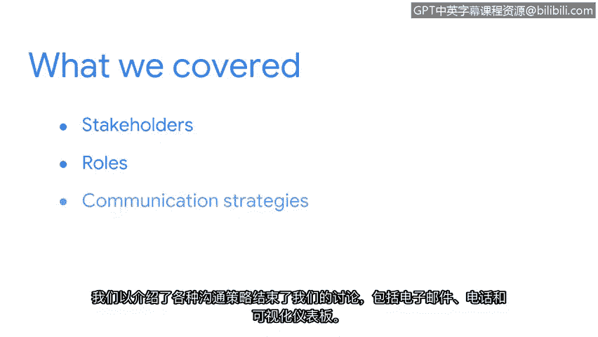

**谷歌网络安全专业证书第八课：投入实践：为网络安全工作做好准备：P19：总结**

在本节中，我们将回顾并总结关于利益相关者沟通的核心要点。

---

我们已经有机会学习了利益相关者所扮演的重要角色，以及与他们的不同沟通方式。

让我们回顾一下所涵盖的内容。我们首先定义了利益相关者及其在保护组织安全中的角色。

接着，我们探讨了与利益相关者沟通的敏感性，以及谨慎、保密地分享信息的重要性。

然后，我们讨论了需要传达给利益相关者的信息。毕竟，利益相关者通常非常繁忙，因此我们只应分享他们需要了解的相关信息。

最后，我们介绍了多种沟通策略，包括电子邮件、电话和可视化仪表板。

---

理解组织内的利益相关者是谁以及如何与他们沟通，将贯穿你作为安全专业人士的整个职业生涯。

请有意识地选择你使用的沟通策略。从沟通中移除不必要的细节，在向利益相关者传递信息时，力求具体和精确。

利益相关者依赖你，作为一名“故事讲述者”，以一种易于理解的方式向他们传达安全状况、潜在问题及解决方案。我们讨论的沟通策略将帮助你脱颖而出，展现出兼具技术和可迁移技能的综合能力。

接下来，本课程最后部分的讲师艾米丽，将讨论几种与安全社区互动的方式，以及如何在安全领域寻找并申请工作。

---

本节课中，我们一起学习了利益相关者的定义、沟通的敏感性、信息筛选的重要性以及多种实用的沟通策略。掌握这些知识，将为你的网络安全职业生涯奠定坚实的软技能基础。