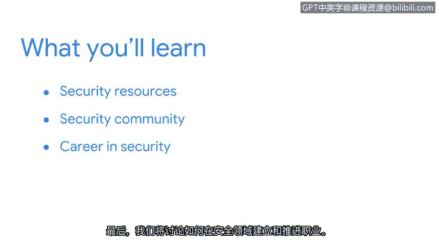

# 020：欢迎来到第四周

在本节课中，我们将学习如何为网络安全职业生涯做好准备，包括如何利用资源保持知识更新、融入安全社区以及规划职业发展路径。

## 课程概述

欢迎回来。我是艾米丽，我在谷歌的安全教育部门工作了近九年。我的团队与杰出的安全专家紧密合作，为我们的员工设计创新且引人入胜的教育方案，以确保安全始终处于首要位置。在接下来的课程中，我将担任你们的讲师，讨论与职业相关的重要主题，例如如何参与安全社区、在安全领域寻找工作、撰写简历以及应对面试流程。

## 回顾与展望

我们即将完成整个证书课程的学习。到目前为止，这是一段非常精彩的旅程。我们已经讨论了许多内容，包括事件检测与升级，以及利益相关者在保护组织安全中所扮演的角色。我们还探讨了所分享信息的敏感性，以及向利益相关者传达关键信息的策略。

但是，随着课程接近尾声，学习就停止了吗？当然不是。在接下来的视频中，我们将识别一些可靠的安全资源，你可以利用它们来随时了解安全新闻和趋势。然后，我们将分享一些融入安全社区的方法。最后，我们将讨论如何在安全领域建立并推进职业生涯。

接下来，我们将重点介绍一些优秀的资源，帮助你了解安全行业的最新动态。