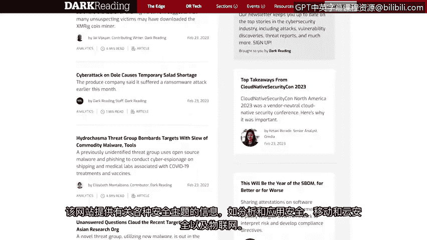

# 021：有用的网络安全资源

在本节课中，我们将学习如何利用关键的在线资源来保持对网络安全行业最新动态的了解，并持续进行自我教育。

随着我们的课程接近尾声，开始思考如何与安全社区互动变得非常重要。由于行业不断发展，及时了解最新的安全趋势和新闻至关重要。接下来，我们将讨论一些值得你定期查阅的优秀资源。

## 📈 持续演进的行业

安全领域最令人兴奋的一点在于其持续的演进。以 **OWASP Top 10** 为例，我们在课程早期讨论过，这是一份全球公认的标准意识文档，列出了Web应用程序面临的十大最关键安全风险。这份列表每三到四年就会更新一次，这完美地体现了该领域不断变化的本质。

在本证书课程之外继续你的安全教育，将有助于你在招聘经理面前脱颖而出，并可能让你比其他候选人更具优势，因为这表明你愿意紧跟行业动态。

## 🌐 推荐的安全网站与博客

以下是几个知名的安全网站和博客，可以帮助你入门：

*   **CSO Online**：该网站提供关于各种安全和风险管理主题的新闻、分析和研究。许多首席安全官（CSO）都会浏览此网站以获取建议和灵感。建议你不时查阅这份出版物。
*   **Krebs on Security**：这是一个由前《华盛顿邮报》记者布莱恩·克雷布斯创建的深度安全博客。该博客涵盖安全新闻以及对各种网络攻击的调查。访问克雷布斯博客是了解全球最新安全新闻和动态的好方法。
*   **Dark Reading**：这是一个深受安全专业人士欢迎的网站。该网站提供关于各种安全主题的信息，例如分析与应用安全、移动与云安全，以及物联网（IoT）。

## 🔄 保持与时俱进

安全是一个不断发展的行业。作为安全领域的专业人士，我们必须通过寻求新信息来与之共同进步。请务必探索我们在本视频中讨论的一些网站和博客，以随时了解行业动态。

在本节课中，我们一起学习了如何利用**OWASP Top 10**、**CSO Online**、**Krebs on Security**和**Dark Reading**等关键资源来保持知识的更新，并强调了持续学习在快速变化的网络安全领域中的重要性。