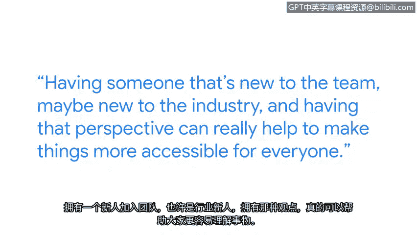

# 022：继续你的学习之旅

## 概述
在本节课中，我们将跟随谷歌安全工程师维多利亚的分享，了解她作为一名非传统计算机科学背景的从业者，如何进入并适应网络安全领域。我们将探讨持续学习的重要性、构建多元化团队的价值，并为初学者提供实用的职业发展建议。

---

我是维多利亚，是谷歌的一名安全工程师。当我第一次申请网络安全工作时，我感到不知所措。我并非接受传统计算机科学教育的申请者。实际上，我的专业是生物学。每当招聘人员看到我的简历时，我总会有点担心，害怕他们看到“生物学专业”后会说：“你为什么要申请这个职位？”并立即忽略我的简历。

我认为我所在的团队非常多元化。我们有很多来自不同背景的人。我认为多元化团队的一个好处是，你们可以针对一个问题获得不同的视角。如果所有人的背景都相同，你们可能无法想出新的解决方案。团队中有新人，甚至是行业新人，他们的视角确实有助于让事情对每个人来说都更容易理解。

---

上一节我们了解了多元化背景的价值，本节中我们来看看为什么在网络安全领域持续学习至关重要。

网络安全领域持续学习很重要，因为事物总是在变化。几年前的一个重大威胁，今天可能已经不同了。努力跟上不断变化的形势，是我工作职责的核心部分。为了支持我在安全领域的持续教育，我会参加课程，如果可能的话，也会尝试考取证书。但其中很大一部分只是跟上当前的行业新闻。无论是关于已发生漏洞的新博客文章，还是对新发布恶意软件的详细分析。我努力至少对行业内的不同趋势保持最表面的了解。

除了这些，我经常参加本地会议。这些是规模较小、由本地组织的会议，因此你有更多机会与本地安全社区互动。这是在像Defcon或Black Hat这样的大型会议上无法获得的体验。与本地人建立联系是了解你所在地区情况、结识其他对安全同样感兴趣的本地人士的好方法，你们可以进行更持续的交流。

---

在进入我的角色之前，我希望我当时能明白：不知道所有事情是可以的，你也不必知道所有事情。你有队友和其他人可以帮助你弥补你薄弱的领域。所以，如果你不了解所有关于安全的知识，不要感到压力，因为没有人能做到。从事安全工作非常有趣，很多事情都可能发生。每天的工作都不同。所以，如果你喜欢动态且不断变化的事物，那么安全领域就适合你。

---

## 总结
本节课中，我们一起学习了维多利亚从生物学背景转型为安全工程师的经历。她强调了**多元化团队**的价值在于提供**不同视角**以催生创新解决方案。同时，我们认识到网络安全领域**持续学习**的极端重要性，因为威胁态势**不断变化**。学习方法包括**参加课程**、**获取证书**、**关注行业新闻**以及**参与本地安全社区**。最后，对于初学者，关键的建议是：**接受自己不可能知道一切**，善于利用团队协作，并且如果你热爱**动态变化**的环境，网络安全将是一个充满乐趣的正确选择。