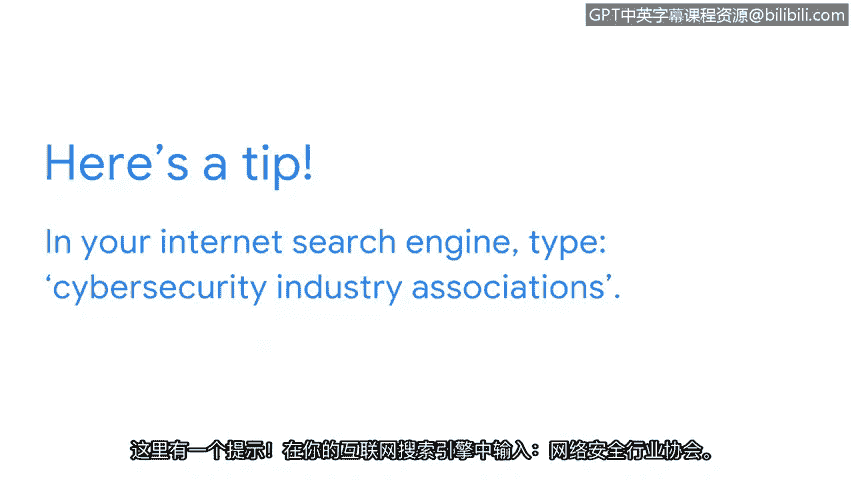

# 023：与网络安全社区进行有意义的互动 🛡️🤝

在本节课中，我们将学习如何通过与网络安全行业内的专业人士建立联系，来确立并推进你的职业生涯。我们将重点探讨利用社交媒体和行业组织进行有效互动的方法。

---

之前，我们讨论了及时了解安全趋势和新闻的重要性。本节中，我们来看看如何通过与行业内的从业者建立联系，来确立并推进你的网络安全职业生涯。

社交媒体是与业内其他安全专业人士建立联系的绝佳方式。然而，必须注意你在社交媒体页面上分享的信息，以及在回复陌生人消息时的谨慎。

考虑到这一点，我们来讨论如何有效利用社交媒体来确立或推进你的安全职业生涯。

以下是利用社交媒体的一种方式：关注或阅读安全行业领导者的帖子。

例如，首席信息安全官（CISO）是非常值得关注的对象。他们经常发布在安全领域进行的访谈，并分享他们阅读过或参与撰写的文章。

你可能会问自己一个问题：如何在社交媒体上找到可以关注的CISO？最好的方法是，在互联网上搜索你感兴趣或心仪组织的CISO姓名。找到名字后，你可以直接去社交媒体网站查找他们。

理想情况下，关注安全专业人士时，建议使用**LinkedIn**。因为LinkedIn平台专注于连接同一或相似领域的专业人士。

利用社交媒体确立或推进安全职业生涯的另一种方式是，与目前在该领域工作的其他安全分析师建立联系。

在LinkedIn等社交网络上，你可以通过搜索“网络安全分析师”或类似术语来找到安全专业人士，然后筛选“人员”以及谈论 **`#cybersecurity`** 标签的人。找到你想联系的其他专业人士后，你可以发送连接请求，并附上简短的评论，例如：“你好，我想与你建立联系，以了解更多关于你对安全产生兴趣的原因以及作为分析师的经验。”

此外，你可以设置筛选条件，找到专注于你感兴趣的安全相关主题的活动和小组。

虽然像LinkedIn这样的社交媒体平台非常适合与专业人士建立联系，但有些人对在社交媒体上保持活跃比其他人更适应。

对于那些不太活跃于社交媒体的人，还有其他方式可以与安全专业人士联系或在行业内寻找导师。

加入不同的安全协会是与他人建立联系的好方法。市面上有很多协会，因此你需要做一些研究来找到最适合你的。

这里有一个小技巧：在你的互联网搜索引擎中，输入 **`cybersecurity industry associations`**。这个搜索词会列出各种不同的协会，请务必选择那些与你职业目标相符的。

---

现在我们已经讨论了与安全社区互动的方法，可以考虑在LinkedIn上关注一位CISO、与其他分析师建立联系，或者搜索可以加入的网络安全组织。

本节课中，我们一起学习了如何通过社交媒体和行业组织，与网络安全社区进行有意义的互动，从而为职业发展铺平道路。