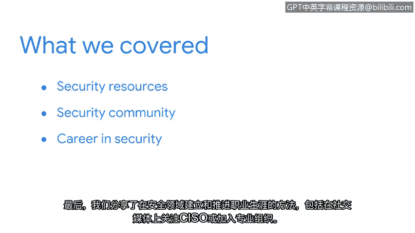

# 025：总结

在本节课中，我们将回顾如何保持与安全社区的互动，并总结本课程的核心要点。

## 课程回顾

上一节我们介绍了多种与安全社区互动的方式，本节中我们来总结一下本课程所涵盖的关键内容。

首先，我们学习了如何识别可靠的安全资源。

其次，我们探讨了与安全社区互动的不同方式。

接着，我们探索了社交媒体的实用性，它可用于连接其他安全专业人士并了解当前的热门话题。

最后，我们分享了在安全领域建立和推进职业生涯的方法，包括在社交媒体上关注首席信息安全官或加入专业组织。

## 核心要点总结

以下是本课程中我们共同学习的关键内容列表：

*   **识别可靠资源**：学会寻找并依赖权威、准确的安全信息来源。
*   **社区互动方式**：参与论坛、会议、本地聚会等多种形式的社区活动。
*   **利用社交媒体**：通过平台如Twitter、LinkedIn等与同行建立联系并跟踪行业动态。
*   **职业发展路径**：通过关注行业领袖和加入专业组织来规划和发展个人职业生涯。

## 课程进展与展望

我们已经在这段学习旅程中取得了长足的进步。你应该为自己的进展和所达到的程度感到自豪。

在本课程的最后部分，我们将花时间为你准备求职和面试过程。这非常令人期待。