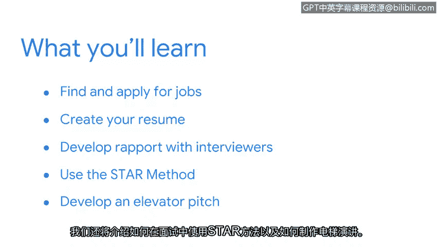

# 026：欢迎来到第五周

在本节课中，我们将学习如何为寻找初级网络安全分析师职位做好准备。我们将探讨具体的求职策略，包括简历撰写、面试技巧以及如何建立行业人脉。

---

欢迎回来。在本课程中，我们已经详细探讨了许多与安全相关的主题。我们讨论了保护组织资产和数据的方法，以及用于保护它们的工具和流程。我们还探索了如何与利益相关者沟通，如何利用可靠的信息源来跟进安全新闻与趋势，以及如何参与安全社区以帮助您在该领域建立并推进您的职业生涯。

现在，我们需要帮助您为寻找一份初级安全分析师的工作做好准备。😊

网络安全是一个广阔的领域，拥有无数的就业机会。根据美国劳工统计局的数据，预计到2030年，安全相关职位的数量将增长超过30%。

但是，您如何才能在未来找到适合自己的机会呢？在接下来的几个视频中，我们将讨论具体的策略，以帮助您在行业中寻找并申请工作。

以下是本部分将涵盖的核心内容：
*   如何创建您的简历。
*   如何与面试官建立融洽关系。
*   如何使用**STAR方法**进行面试。
*   如何准备一段精彩的电梯演讲。

---

我记得最初对我的职位产生兴趣，是因为教育是我的热情所在。在为面试做准备而研究安全领域和行业的过程中，我更加坚定了对网络安全的着迷。😊

坦诚地说，我曾将安全的许多作用视为理所当然。现在，我感到非常幸运能成为这个行业的一员，并享受它所带来的激动人心的机遇。😊

现在，是时候帮助您为寻找网络安全工作做好准备了。让我们开始吧。

---

本节课中，我们一起学习了为求职做准备的概述，了解了网络安全领域的广阔前景，并预览了后续将深入探讨的简历、面试与人际沟通等核心求职策略。