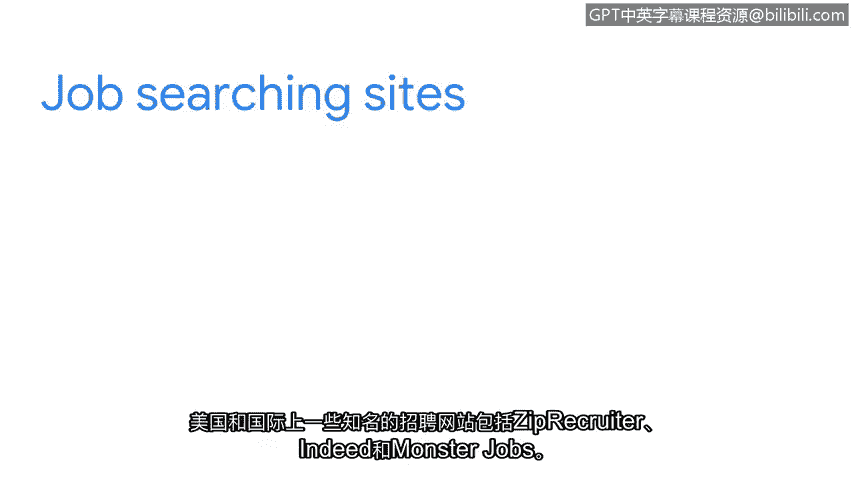

**网络安全职业准备：第八课：探索网络安全工作岗位** 🎯

在本节课中，我们将探索三种常见的网络安全工作岗位，并了解如何为求职做准备。课程将涵盖安全分析师、信息安全分析师和安全运营中心分析师的角色，以及如何利用招聘网站寻找机会和准备简历。

---

### **网络安全入门角色**

上一节我们介绍了课程的整体目标，本节中我们来看看几个具体的网络安全工作岗位。以下是三种适合初学者的常见角色：

*   **安全分析师**：这是一个典型的入门级职位。该角色主要侧重于监控网络是否存在安全漏洞、制定策略以保护组织安全，以及研究IT安全趋势。在之前的课程中，我们讨论过日志监控和**SIEM工具**。扎实掌握这些工具的使用基础，对此职位非常有用。
*   **信息安全分析师**：该角色主要侧重于制定计划并实施安全措施，以保护组织的网络和系统。在本课程早期，你学习了可用于制定安全计划和流程的**控制措施和框架**，以及如何使用**SIEM**和**数据包嗅探器**来识别风险。这些知识对于制定计划和确定最佳工具以加强组织的安全态势非常有益。
*   **安全运营中心分析师**：也称为**SOC分析师**。该角色主要侧重于确保按照既定策略和流程快速有效地处理安全事件。之前我们讨论过**安全预案**及其对每个组织的独特性。我们还强调了遵循预案中概述的流程来响应安全事件的重要性。掌握这些知识将有助于你成为该职位的潜在候选人。

### **寻找更多工作机会**

除了上述角色，还有许多其他网络安全职位可能让你感兴趣。寻找这些职位的一个好方法是在各大招聘网站上创建账户并搜索网络安全相关职位。

以下是美国和国际上一些知名的招聘网站：

*   ZipRecruiter
*   Indeed
*   Monster

这些网站上都有数百个开放的职位列表，每个职位标题下都列出了角色职责和技能要求。

### **申请职位前的准备工作**

现在我们已经讨论了工作岗位和申请渠道，但在申请任何职位之前，做好研究至关重要。

你需要收集关于公司、职位角色以及所需和优先技能的大量信息。这将帮助你为潜在面试做好准备，让你确切了解雇主的期望以及你的技能如何与之匹配。这也有助于你将个人价值观和热情与组织的使命和愿景结合起来。

### **制作吸引人的简历**

但在申请安全职位之前，制作一份能吸引雇主注意的简历非常重要。接下来，我们将详细讨论简历的撰写过程。

---

**总结**：本节课我们一起学习了三种网络安全入门级角色（安全分析师、信息安全分析师、SOC分析师）的职责与所需技能，了解了如何利用招聘网站寻找工作机会，并强调了申请前研究公司和准备简历的重要性。