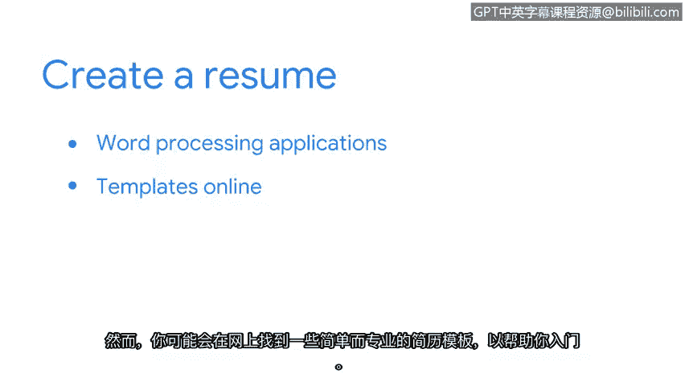

**网络安全求职准备：第八课：创建一份简历**

在本节课中，我们将学习如何创建一份针对你所申请职位量身定制的简历。请注意，简历有时也被称为Curriculum Vitae，简称CV。

**概述**

一份出色的简历是开启网络安全职业生涯的关键。即使你没有任何直接的网络安全工作经验，通过本证书课程所学的技能和概念，你同样可以构建一份有竞争力的简历。本节将引导你完成简历的各个组成部分，并提供实用的创建技巧。

**没有网络安全经验怎么办？**

请记住，没有直接的网络安全工作经验是可以接受的。本证书课程已经涵盖了入门级安全分析师职位所需的关键技能和概念。你可以在简历中提及你在此课程中学到的所有内容。

以下是你可以重点突出的技能和知识领域：

*   **编程语言与工具**：例如 **Python**、**SQL** 和 **Linux命令行**。
*   **安全思维**：你对拥有安全思维意味着什么的理解。
*   **标准框架与模型**：你对诸如 **NIST CSF** 和 **CIA三元组模型** 等标准框架和控制措施的知识。
*   **安全工具**：你对如何使用SIEM工具和数据包嗅探器的熟悉程度。

此外，你之前的工作经历可能也培养了一些可迁移到安全岗位的知识和技能。这些技能可能包括注重细节、团队协作以及出色的书面和口头沟通能力。

**简历结构详解**

上一节我们讨论了简历中可以包含的内容，本节中我们来看看一份标准简历的具体结构。以下是一个简历示例及其各部分的说明。

**1. 个人信息与标题**

简历顶部应以你的姓名开始，紧随其后的是你的职业头衔。你的头衔可以是“安全分析师”或与你申请的职位相匹配的标题。你还需要包含至少一种雇主或招聘人员可以联系到你的方式，例如电子邮件地址或电话号码。

**2. 个人摘要**

在姓名和头衔之后，你需要提供一个摘要陈述。这个部分应该简洁，只需一两句话，与你的优势和相关技能相关。确保陈述中包含职位描述中“职责”部分的特定关键词。

你可以在陈述中包含类似这样的内容：
> 我是一名积极进取的安全分析师，正在寻求一个入门级网络安全职位，以应用我在**网络安全、安全策略和组织风险管理**方面的技能。

**3. 技能部分**

个人摘要之后是技能部分。这是一个项目符号列表，列出你在此课程中学到的、与该职位相关的技能。

**4. 工作经历**

雇主通常希望了解你之前的工作经历。在“工作经历”部分，你将列出你的工作历史。在每个工作条目下，提供你所执行的技能和职责列表。

创建职责列表时，一个好的做法是每个项目都以动词开头。如果可能，提供可以量化成就的细节。

例如：
*   与一个六人团队合作，为超过25名公司员工开发了培训材料。

尽量突出你基于以往工作经验和本证书课程所获得的安全或技术相关技能和知识。

**5. 教育与认证**

简历的下一部分列出你的教育和认证情况。从你最近完成的教育开始，包括认证、职业学校、在线课程或大学经历。同时，包括颁发你认证的网站和组织名称，以及你就读的学校。列出任何与你申请职位相关的学习科目。

如果你目前正在就读学校或认证课程但尚未毕业，请注明“进行中”。

**创建简历的实用技巧**

在了解了简历的核心结构后，以下是创建简历时需要牢记的几个实用要点。

*   **检查错误**：在将简历发送给潜在雇主之前，确保其中没有拼写或语法错误。
*   **长度与范围**：简历通常约为两页长，并且只列出你最近10年或更短时间的工作经验。
*   **使用模板**：可以使用像Google Docs或Open Office这样的文字处理应用程序创建简历。然而，你可能会在网上找到一些简单但专业的简历模板来帮助你入门。要找到它们，可以在互联网浏览器中输入“免费简历模板”或类似的搜索词。
*   **个性化模板**：如果你使用模板，请务必用你的信息和资历替换所有预填的文本。

**总结**

创建简历需要考虑很多方面，但我们今天所涵盖的内容将帮助你顺利起步。通过突出课程所学、可迁移技能，并遵循清晰的结构，你可以制作出一份有力的求职文件。接下来，我们将探讨面试流程。