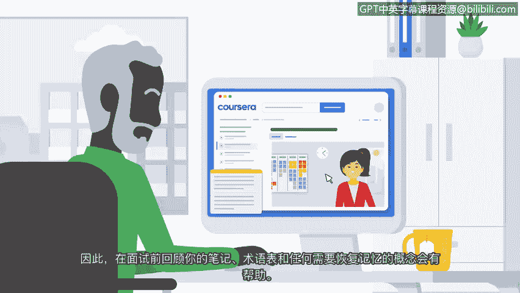

**网络安全求职准备：第八课：探索面试流程** 🎯

在本节课中，我们将学习网络安全岗位的面试流程，并掌握一系列实用的准备策略，帮助你自信地应对面试。

---

在向多个职位投递简历后，你将有机会获得面试机会。面试流程通常从一次简短的电话预筛选开始。招聘经理或招聘人员会与你进行约15分钟的交谈，询问一些问题，以核实你的身份并确认你是否满足职位的最低要求。

通过预筛选后，你可能会被邀请参加现场或线上的面对面面试。这可能是与你未来团队成员进行的**小组面试**，也可能是**一对一面试**。

上一节我们了解了面试的基本流程，本节中我们来看看具体的准备策略。以下是帮助你为面试做好准备的几个关键步骤：

**面试准备策略**

*   **提前审查职位描述与简历**：仔细研究职位要求，并确保你能清晰阐述简历中与雇主需求相匹配的经验和技能。
*   **进行模拟面试练习**：可以请朋友扮演面试官，模拟真实面试场景进行练习，这能有效提升你的临场反应能力。
*   **选择得体的着装**：穿着专业且舒适的服装，这有助于你建立良好的第一印象并增强自信。
*   **面试前调整状态**：在面试开始前，做几次深呼吸，回想自己所做的充分准备，以平静心态。
*   **做好线上会议准备**：如果面试通过视频会议进行，请提前准备一个安静、整洁、专业的空间。务必测试**视频和音频设置**，必要时提前下载面试官指定的会议应用程序，以避免技术问题。

---

了解了一般性准备后，我们来看看面试通常包含的两个核心部分。面试通常包括**背景面试**和**技术面试**两部分。

**背景面试**部分，面试官可能会询问你的教育背景、工作经验、技能和能力。有时甚至会问一些与职位无关的个人问题。其目的是了解你，判断你是否与团队及公司文化相匹配。同时，这也是你通过提问来评估该公司和团队是否适合你的机会。

**技术面试**部分，面试官会针对该职位相关的技术技能提出具体问题。例如，你可能会被问到如何处理某个特定场景，或者需要解释简历上列出的某个技术概念。请基于你现有的知识，尽可能自信、简洁地回答。如果遇到不知道答案的问题，可以直接说明，或请求一点时间思考。雇主尊重诚实的态度。你可以随后补充说明你将如何找到答案，例如通过**研究**或与团队**协作**。

---

即使在你完成本证书课程后，你仍然可以访问所有学习内容。因此，在面试前，建议你回顾笔记、术语表以及任何需要重温的概念。这能帮助你更好地应对可能被问到的问题。

请记住，你可以通过**参与模拟面试**、**仔细研究职位描述**以及在**面试前深呼吸**来做好充分准备。你已在本课程中学到很多，准备好向前迈进，寻找安全分析师职位了。

接下来，我们将讨论如何进行面试前的调研。

**总结**：本节课我们一起学习了网络安全岗位的面试流程，包括预筛选、面试类型（小组/一对一），并掌握了一系列面试准备策略，如模拟练习、着装、技术准备等。我们还深入了解了面试的两个核心部分——背景面试与技术面试的要点与应对方法。充分的准备是面试成功的关键。