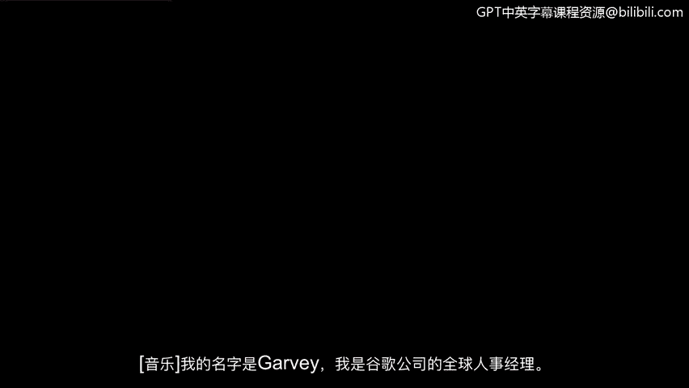
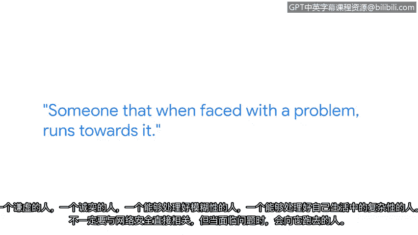

# 031：技术面试技巧

## 概述
在本节课中，我们将学习来自谷歌全球招聘经理加维的技术面试建议。这些建议旨在帮助初学者为网络安全领域的初级职位技术面试做好准备，内容涵盖面试心态、知识准备、问题回答策略以及面试官看重的核心素质。

---

## 面试心态：超越答题测验
上一节我们了解了课程背景，本节中我们来看看面试官对面试的根本看法。不要将技术面试视为一场在限定时间内回答尽可能多问题的简单测验。

作为一名面试官，我想知道的是候选人是否理解基础知识，以及能否向我清晰地解释这些知识。

---

## 知识准备：掌握核心基础
理解了面试的核心目的后，接下来我们需要知道应该准备哪些具体内容。对于申请初级职位的面试，我推荐准备以下程序和应用程序：

以下是建议重点掌握的工具与领域：
*   **Splunk** 与 **Wireshark**：理解它们的功能和目的。
*   如果能进一步理解其内部原理、它们为何存在，以及如果它们不存在该如何解决问题，则会更具优势。
*   掌握网络安全领域内各主题的基础知识，例如：
    *   网络安全
    *   Web应用程序安全知识
    *   操作系统内部原理理解
    *   安全协议的掌握

我认为这是开始准备的**重要起点**。

---

## 回答策略：应对开放式问题
掌握了基础知识后，我们来看看面试中最具挑战性的部分——开放式问题。这类问题往往非常困难，其设计本身就是模糊和复杂的。

面对此类问题，请遵循以下步骤：
1.  **首先提出澄清性问题**：从面试官那里获取信息，以帮助你缩小问题本身的焦点范围，同时也降低问题的范围，使其成为你自己能够回答且感到舒适的问题。
2.  **使用STAR方法组织答案**：当面对一个庞大的开放式问题时，这是一个很好的自我组织方式。它能帮助面试官理解你的思路。
3.  **大声思考**：这也会帮助面试官理解你的思考方向。例如，“我明白加维的回答思路了，如果需要帮助我可以引导他，也许他无法得出完整答案，但我知道他走在正确的轨道上，因为我听到了他的思考过程。”

如果你不知道答案，这没关系。再次强调，没人期望你无所不能。但我们不希望你撒谎。

---

## 核心素质：面试官寻找的候选人
了解了如何回答问题，我们来看看面试官心目中理想的候选人是什么样的。我理想的候选人是热爱学习、谦逊诚实的人，是能够在生活中应对模糊性和复杂性的人。

这不一定直接与网络安全相关，而是指那些面对问题时勇于迎难而上的人。他们始终保持学生的态度，不断学习；他们也是导师，能够领导并帮助他人。他们在生活中始终展现出这些特质。

---

## 应对紧张：信任自己
在技术面试中感到紧张是很正常的。我认为这很标准。紧张没关系，这意味你在乎。你出现在那里是有原因的，你发现自己身处那个时刻是有原因的。

已经有人认可了你，他们相信你。并且，这个领域需要你。所以，我会说，信任你自己，相信你的直觉。不要害怕失败。

---

## 总结
本节课中，我们一起学习了为网络安全技术面试做准备的关键要点。我们明确了面试不是简单的答题测验，而是展示对基础知识的理解和应用能力。我们列出了需要重点掌握的工具和知识领域，学习了使用**STAR方法**和“大声思考”来应对复杂的开放式问题。最后，我们了解到面试官看重的是候选人**热爱学习、诚实谦逊、勇于面对挑战**的核心素质，并认识到面试中保持自信、信任自己至关重要。