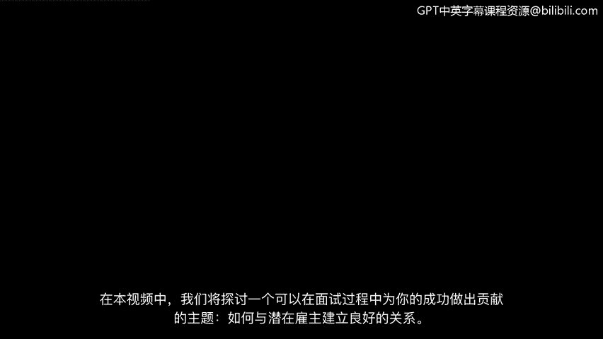
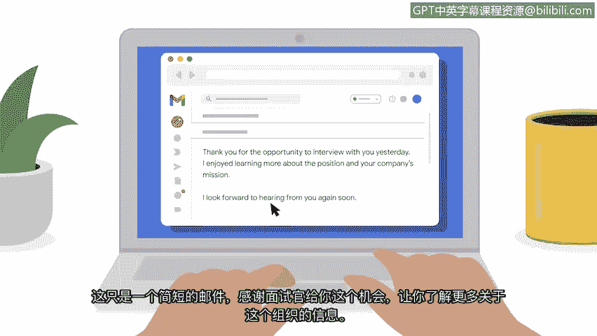

# 033：与面试官建立融洽关系

在本节课程中，我们将探讨一个能帮助你在面试过程中取得成功的话题：如何与潜在雇主建立融洽关系。融洽关系是一种友好的关系，在这种关系中，双方能理解彼此的想法并顺畅沟通。

## 建立融洽关系的重要性

上一节我们讨论了面试准备，本节中我们来看看如何在实际互动中建立良好印象。建立融洽关系从你与公司员工的第一次互动就开始了，无论是通过电话、电子邮件还是视频会议。

## 建立融洽关系的具体方法

以下是建立融洽关系的几个关键步骤。

**1. 初次沟通**
在撰写的电子邮件中，使用专业的语气表达你对职位的兴趣非常重要。同时，保持礼貌和友好也很关键。表达对获得考虑和潜在面试机会的感谢，是建立融洽关系的一种方式。

**2. 电话筛选**
当你进行初步电话筛选时，可以使用友好、对话式的语气。尝试在说话时保持微笑。虽然在电话中对方看不到你的笑容，但微笑能让你的声音听起来更友善。

**3. 面试进行中**
在电话筛选和现场面试期间，你可以通过积极参与来缓解面试紧张感，方式要让你感觉自然。这可以简单地说一句“你好，很高兴见到你”。你甚至可以通过询问面试官今天过得怎么样来开启一段简短友好的对话。如果刚过完周末，你可以问面试官“周末过得如何？”。

**4. 非语言交流**
在现场面试中提问时，请进行眼神交流；在视频面试中，请务必直视摄像头。这将向面试官表明你专注于对话。

**5. 提问环节**
通常，在面试的后半段，面试官会询问你是否有问题要问。正如我们之前讨论的，准备一些问题在此刻提问非常重要。以下是一些建议：
*   你可以问：“担任这个角色我可能面临的最大挑战是什么？公司期望我如何应对这个挑战？”
*   或者你可以问：“你认为在这家公司工作最好的部分是什么？”或“分析师的典型一天是怎样的？”
*   另一个很好的问题是：“这个角色的成长潜力如何？”

提问表明你积极参与对话，并且对公司及职位感兴趣。这也向雇主表明你很自信，并且希望在做出承诺之前确保他们的公司是适合你的选择。

**6. 后续跟进**
在面对面面试结束一两天后，发送一封后续邮件是个好主意。这只是一封简短的邮件，感谢面试官给予见面和了解更多关于组织信息的机会。在这封邮件中提到你面试中的某个具体细节也是个好主意，这表明你积极投入了对话。请记住，雇主可能正在面试其他候选人，因此发送后续邮件将有助于让你脱颖而出，并提醒面试官记住你们的讨论。

## 总结

在本节课中，我们一起学习了为你的第一个安全职位面试时，与面试官和其他员工建立融洽关系是一项重要技能。在面试前后撰写友好而专业的电子邮件，并在面试期间进行友好对话，可以帮助你脱颖而出，成为该职位的优秀候选人。😊