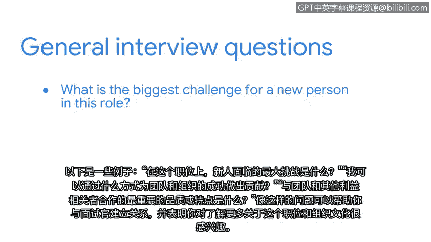

# 035：向面试官提问

在本节课程中，我们将探讨在求职面试中可以使用的额外策略。我们将重点学习如何向面试官提出有价值的问题，以展示你的准备程度和对职位的兴趣。

在过去的求职面试中，你的潜在雇主可能曾问过：“你对我有什么问题吗？”这类问题为你提供了一个机会，可以向面试官展示你已做好准备，并愿意与他们进行有意义的对话。

面试准备的一个重要部分是在面试前对公司进行研究。因为这能让你提出一些问题，证明你花时间了解了该组织及其需求。这类问题表明你对你的职业充满热情，并且你希望帮助公司加强其安全状况。

## 准备有深度的问题

上一节我们介绍了面试前研究公司的重要性，本节中我们来看看具体可以准备哪些问题。以下是一些你可以向面试官提出的通用问题，以确定这份工作和组织本身是否适合你：

*   **角色挑战**：`What‘s the biggest challenge for a new person in this role?`（新人在这个角色中面临的最大挑战是什么？）
*   **团队贡献**：`In what ways can I contribute to the success of the team and the organization?`（我可以通过哪些方式为团队和组织的成功做出贡献？）
*   **重要品质**：`What qualities or traits are most important for working well with the team and other stakeholders?`（要与团队和其他利益相关者良好合作，最重要的品质或特质是什么？）

## 提问的价值与心态

像上述这样的问题可以帮助你与面试官建立融洽的关系，并表明你有兴趣更多地了解这个职位和组织文化。当你做好准备时，求职面试可以是一个非常令人兴奋的过程，而提问是面试过程中必不可少的一部分。

**核心心态**：`Don‘t be afraid to ask potential employers tough questions.`（不要害怕向潜在雇主提出尖锐的问题。）这将帮助他们了解你是一个深思熟虑、充满好奇心、能为团队增加价值的人。

本节课中，我们一起学习了在面试中主动向面试官提问的策略。通过提出经过研究、有针对性的问题，你不仅能获取关键信息，还能有效展示自己的专业素养和主动性。记住，一次成功的面试是双向的沟通。

接下来，我们将讨论另一个重要策略：电梯演讲。