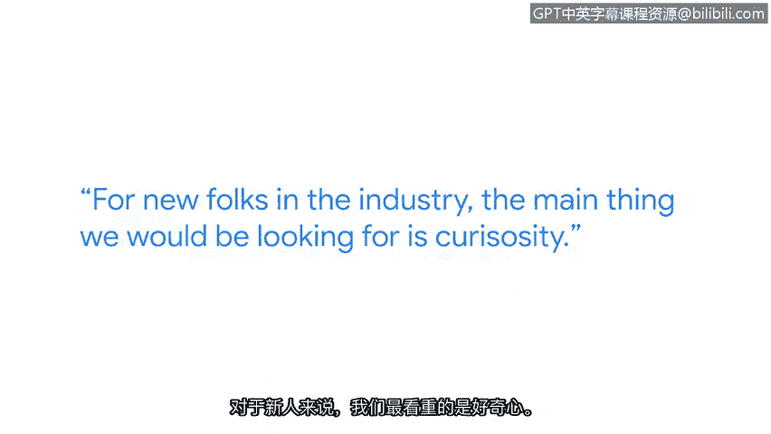
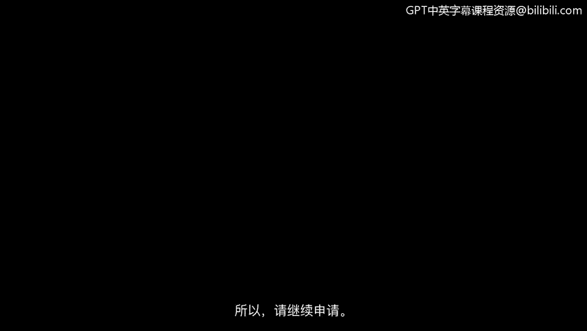

# 036：一个招聘经理的面试技巧

## 概述
在本节课中，我们将学习来自谷歌安全工程经理卡兰的面试技巧。卡兰将分享他作为招聘经理，在面试数百名候选人后总结出的宝贵经验，特别是针对非技术背景转行者的建议。我们将从技术准备和非技术准备两方面，了解如何有效备战网络安全岗位的面试。

---

## 技术准备：夯实基础，明确问题

上一节我们介绍了课程概述，本节中我们来看看面试的技术准备部分。卡兰建议，技术准备的核心在于构建扎实的基础知识体系，并在面试中清晰地展示你的问题解决思路。

以下是技术准备的两个关键点：

*   **巩固基础知识**：重点构建网络基础和信息安全基础。确保理解核心概念的工作原理及其相互关联。这可以通过系统学习或实践项目来完成。
*   **明确问题再解答**：在回答技术问题时，务必先提出澄清性问题，以理解问题的根源和面试官的期望。许多人会直接跳入问题，而没有真正明确要求。

如果在面试中遇到不懂的问题，不要害怕说“我不知道”。更好的方式是补充说明：“我不知道，但我会这样尝试解决……” 这展示了你的解题思路和学习能力。

---

## 非技术准备：展现自我，突出软技能

在掌握了技术准备的要领后，我们来看看同样重要的非技术准备。这部分关乎你如何展示个人特质和团队协作能力。

卡兰强调，非技术准备的关键在于练习和真实地展现完整的自我。

以下是非技术准备的几个有效方法：

*   **模拟面试**：与朋友或面试伙伴进行练习，观察自己的反应，找出需要改进的地方。在这个过程中，请对自己保持耐心。
*   **展现完整的自我**：在面试中，重点展示你将如何与团队合作。可以提及你与他人合作完成的项目案例，以及你在其中如何发挥领导作用。
*   **提及开源协作经验**：如果你参与过开源项目协作，这将是展示你协作能力的绝佳例证。

卡兰指出，这些软技能至关重要，即使在解决具体的安全问题时，团队协作和沟通能力也是招聘方考量的重点。

---

## 行业新人：我们寻找什么特质？

对于行业新人，招聘经理最看重的特质是什么？卡兰从个人角度给出了明确的答案。

我们寻找的核心特质是**好奇心**和**驱动力**。我们寻找那些有强烈动力去深入学习这个领域的人。他们可能并非无所不知，但我们希望确保他们能提出正确的问题，并通过与他人合作来解决问题。

因此，一个像“我不知道，但我会想办法搞清楚”这样的回答，在面试官看来可能非常出色。

---

## 关键建议：勇于尝试，不怕拒绝

在了解了面试的考察要点后，卡兰最后给出了一些鼓励和非常实用的申请建议。

*   **不要害怕被拒绝**：找到第一份工作需要时间。卡兰本人也曾投递了数百份申请才找到第一份工作。
*   **大胆申请**：即使你不完全满足职位描述中的所有“要求”或“优先考虑”条件，也请尝试申请。主要关注“最低要求”，如果你符合，就值得投出简历。

所以，请持续尝试，不要放弃。

---

## 总结
本节课中，我们一起学习了谷歌安全工程经理卡兰分享的网络安全岗位面试技巧。我们了解到，成功的面试需要从**技术准备**和**非技术准备**两方面着手：技术层面要夯实基础、善于澄清问题；非技术层面则要通过练习来展现真实的自我和突出的软技能。对于新人而言，展现**好奇心**、**驱动力**和**协作精神**至关重要。最后，记住要勇于尝试，不怕拒绝，持续投递简历。祝你面试顺利！😊