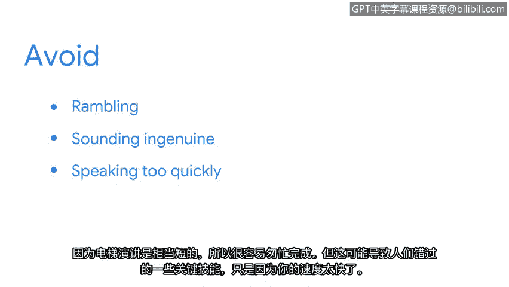

# 037：制定个人介绍

## 概述

在本节课中，我们将学习如何制定一个有效的“电梯演讲”。这是一种简洁的自我介绍方式，能帮助你在短时间内向潜在雇主展示你的优势、技能和职业热情，是求职和社交场合的重要工具。

---

## 什么是电梯演讲？🚀

首先，我们来讨论一个能帮助你识别自身优势，并向他人展示这些优势的概念——电梯演讲。

电梯演讲是对你的经验、技能和背景的简短总结。它之所以被称为“电梯演讲”，是因为它应该足够简短，能在60秒或更短的时间内说完，这大约是你与某人在电梯里交谈的平均时间。

电梯演讲让你能在极短的时间内向潜在雇主展示你是谁。它可以在招聘会、职业博览会以及其他社交场合使用，例如专业会议和像领英这样的社交媒体求职网站。

---

## 如何构建你的电梯演讲？🛠️

上一节我们介绍了电梯演讲的概念，本节中我们来看看如何创建一个有效的电梯演讲。

你的电梯演讲需要简短且有说服力。无需列出你所有的过往经历和成就。相反，你应该解释你是谁、为何对成为一名安全专业人员充满热情，以及你所拥有的与获得安全分析师职位特别相关的资格和技能。

以下是构建电梯演讲时需要包含的核心要素：

*   **你是谁与你的热情**：简要说明你的身份和职业目标。
*   **核心技能**：强调与职位相关的关键技能。例如，批判性思维、解决问题和与他人建立协作关系的能力是大多数组织都在寻找的可转移技能。在你的电梯演讲中突出这些。
*   **技术能力**：提及你在此证书课程中学到的技术技能。例如，使用各种**SIEM工具**和像**SQL**、**Python**这样的编程语言来识别和应对风险。

---

## 需要避免的常见错误⚠️

在了解了如何构建演讲内容后，我们来看看在表达时需要注意避免的几个问题。

以下是进行电梯演讲时需要避免的事项：

*   **避免漫谈或分享无关细节**：潜在雇主只想知道你是谁，以及他们为何应该考虑让你担任安全职位。
*   **避免过度练习导致不自然**：在制定电梯演讲时，你需要多次练习。然而，不要练习过度，以至于在与可能的决策者分享时听起来不真诚或像机器人。相反，在进行电梯演讲时，要像平常对话一样自然表达。这将有助于保持听众的参与度，并对你所说的内容感兴趣。
*   **避免语速过快**：因为电梯演讲相当简短，很容易说得太快。但这可能导致人们错过你的一些关键技能，仅仅因为你语速太快而一带而过。

---

## 最后的建议与总结✨

一个额外的建议是：你可以在网上搜索电梯演讲的例子，以获取灵感，帮助你构思自己的演讲。

本质上，你的电梯演讲是一种告诉人们为何你是安全职位绝佳人选的方式，因为你拥有出色的技能和对职业生涯的清晰规划。

虽然与潜在雇主交谈时感到紧张是自然的，但请记住：深呼吸，保持镇定，以自信、坚定的信念和正常的语速进行你的演讲。你会做得很好的。

---

## 总结

本节课中，我们一起学习了如何制定一个有效的电梯演讲。我们了解了它的定义与用途，探讨了构建演讲内容的核心要素（包括个人介绍、热情陈述、核心可转移技能及具体技术能力），并指出了在表达时需要避免的常见错误（如漫谈、不自然和语速过快）。最后，我们获得了通过搜索范例获取灵感以及保持自信进行演讲的实用建议。掌握这项技能，将帮助你在求职过程中更有效地展示自己。