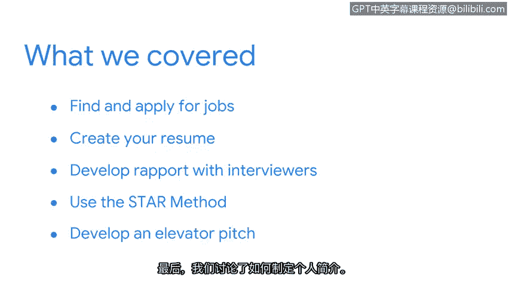

谷歌网络安全专业证书第八课：8：总结

在本节课中，我们将回顾并总结“投入实践：为网络安全工作做好准备”这一章节的核心内容。

你已经出色地完成了本课程章节的学习。现在，让我们花点时间来回顾一下所涵盖的内容。

以下是本章节的主要学习要点：

*   **求职与申请**：我们首先讨论了如何在安全领域寻找和申请工作。
*   **简历撰写**：接着，我们探讨了如何创建一份有效的简历。
*   **面试沟通**：我们分享了一些与面试官建立良好关系的策略。
*   **问题回答技巧**：我们还介绍了如何使用**STAR方法**（情境、任务、行动、结果）来周全地回答开放式的面试问题。
*   **电梯演讲**：最后，我们讨论了如何准备一段精彩的电梯演讲。

本节课中，我们一起学习了网络安全求职准备的关键步骤。希望这些内容能帮助你在开始寻找和申请安全领域的工作时充满信心。祝你好运。