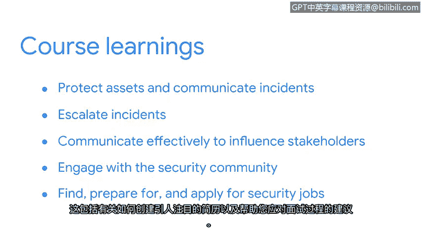

# 040：课程总结

## 概述
在本节课中，我们将回顾整个证书课程的最终部分，总结为网络安全工作做好准备所涵盖的核心知识与技能。

---

恭喜您完成证书项目的最终课程。

我们覆盖了大量信息。现在花点时间回顾一下。

我们首先讨论了如何通过培养安全思维来保护资产并沟通安全事件。

接着，我们探讨了何时以及如何将事件上报给合适的团队成员，以确保小问题不会演变成对组织及其服务对象的大麻烦。

上一节我们介绍了事件上报，本节中我们来看看沟通技巧。我们探索了有效沟通以影响利益相关者安全决策的方法。

这包括讨论如何使用视觉元素传达重要信息，以及发送电子邮件、拨打电话或发送即时消息。

以下是具体的沟通方式：
*   使用图表等视觉工具。
*   撰写清晰的电子邮件。
*   进行有效的电话沟通。
*   发送及时的即时消息。

之后，我们分享了一些与安全社区互动的方式。

以下是主要的互动途径：
*   参加行业会议。
*   通过社交网站与其他分析师建立联系。

然后，我们进入了课程的最后部分，该部分涵盖了如何寻找、准备和申请工作。

这包括讨论如何创建一份有吸引力的简历，以及帮助您应对面试过程的小贴士。

以下是求职准备的核心要点：
*   **简历公式**：`突出技能 + 量化成就 + 匹配职位要求`
*   **面试准备**：研究公司、练习行为面试问题、准备技术问题。

---

## 总结
本节课中我们一起学习了如何培养安全思维、有效沟通与上报事件、参与安全社区，并最终为求职做好充分准备。引导您完成这段旅程，我深感荣幸。