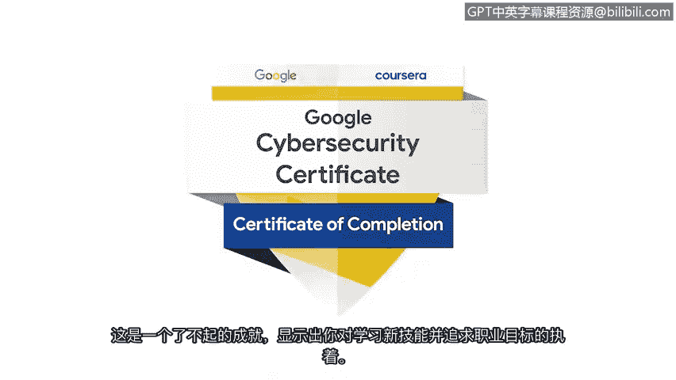

# 042：为网络安全工作做好准备

## 概述
在本节课中，我们将回顾并祝贺您完成谷歌网络安全专业证书项目。这是一个重要的里程碑，标志着您已经掌握了开启网络安全职业生涯所需的核心技能。

---

您刚刚完成了谷歌网络安全专业证书项目。

这是一项非凡的成就，充分展示了您为追求职业目标而学习新技能的坚定承诺。

我谨代表我自己和所有课程讲师，向您表示祝贺。恭喜您，您做到了。

我们迫不及待地想看到你们中有多少人决定投身于这份职业，并在网络安全领域探索那些非常酷的领域。

恭喜您，您是明星。祝贺您，干得漂亮。

您做到了。祝贺您。我支持并祝愿您持续成功。祝贺您的成就，这可能是您做过的最好的决定之一，我期待看到您将体验到的所有机会。祝贺您，您已抵达终点，准备好保护每个人的安全。

请继续学习，继续成长。您会发现这是一个非常有价值的职业。祝贺您，您做到了。

欢迎来到网络安全世界。冒险在此之后仍将继续，网络安全世界仍有更多内容等待探索，但您已经准备就绪。

能够引导您完成本项目的最后部分是我的荣幸。我知道您已经为开启或继续一段卓越的网络安全职业生涯做好了充分准备。

祝贺您，并祝您在未来的旅程中一切顺利。

---

## 总结
本节课中，我们一起庆祝了完成谷歌网络安全专业证书这一重要成就。您已经掌握了关键技能，为进入网络安全领域做好了准备。请记住，学习之旅永无止境，持续成长将为您带来丰厚的回报。祝您在未来的职业道路上取得成功。