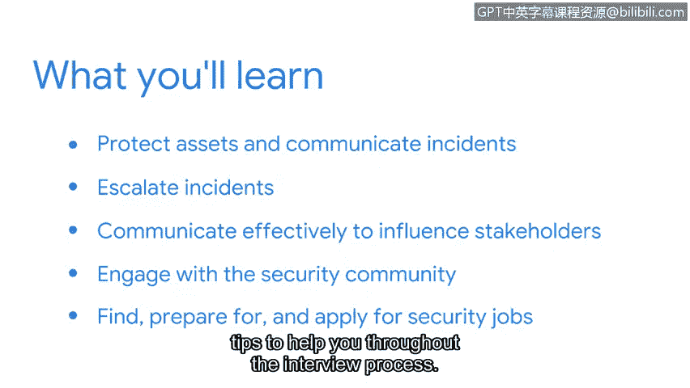

# 043：课程介绍

你好，欢迎来到本课程。我是Dion，谷歌的项目经理。

过去五年，我一直在安全领域工作，涉足风险管理、内部威胁检测等多个方面。

我将担任本课程的第一位讲师。作为一名安全分析师，你将帮助保护所在组织的资产。

这些资产包括有形的或物理的资产，例如软件和网络设备。

也包括无形的资产，例如个人身份信息、版权和知识产权。

想象一下，如果此类敏感信息被威胁行为者泄露，将对组织的声誉、财务稳定性以及组织所服务的人员造成毁灭性打击。

在之前的课程中，我们讨论了与安全专业相关的各种主题，包括核心安全概念、框架与控制、威胁、风险和漏洞、网络、事件检测与响应以及编程基础。

现在，是时候将这些核心安全概念付诸实践了。在本课程中，我们将进一步探讨如何保护资产和沟通事件。

然后，我们将讨论何时以及如何升级事件，以保护组织的资产和数据。

我们还将介绍如何有效沟通，以影响利益相关者做出的与安全相关的决策。之后，本课程第二部分的讲师Emily将介绍一些可靠的资源，帮助你在完成证书课程后与安全社区互动。

最后，我们将介绍如何寻找、准备和申请安全工作。这将包括讨论如何创建一份有吸引力的简历，以及在整个面试过程中为你提供帮助的技巧。

当我开始我的第一份安全基础工作时，我很兴奋能被谷歌聘用，负责保护信息和设备。

我也很高兴能成为一个更广泛团队的一员，我可以向他们学习并寻求支持。

我的团队帮助我增长了专业知识，我为我在我们项目中的贡献感到自豪。

在本课程结束时，你将获得多次机会来深化对关键安全概念的理解，创建一份简历，建立面试技能的信心，甚至参与一次人工智能生成的模拟面试。

安全专业是一个非常棒的领域，我期待你的加入。

我有一个问题要问你。你准备好开始了吗？