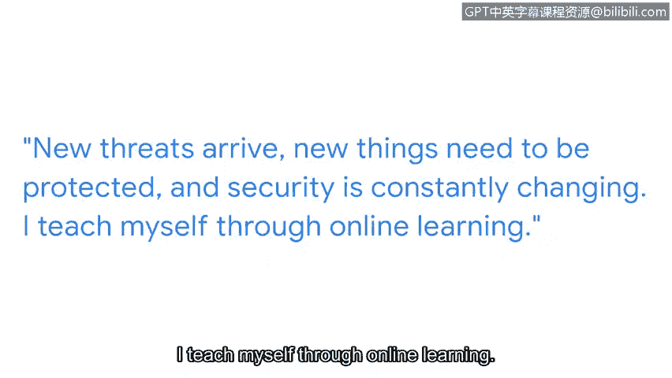

# 044：为网络安全工作做好准备

## 概述
在本节课中，我们将跟随谷歌项目经理迪翁，了解他进入网络安全领域的个人职业旅程。我们将学习网络安全的重要性、从业者的日常工作、所需技能以及如何应对入行初期的挑战。

---

## P44：1_03 迪翁的个人职业旅程

大家好，我是迪翁。我是谷歌的一名项目经理。我隶属于检测与响应团队，该团队属于隐私、安全与保障组织。

### 工作的核心价值
我最喜欢工作的部分是，理解我们每天都会遇到的威胁，而我的团队则致力于确保我们能发现这些威胁并做出相应的响应。

网络安全至关重要。正如我们需要保障自身的人身安全一样，我们也需要确保我们在线上的信息安全无虞。因此，每当你使用计算机或设备时，相关数据都存储在网络上的某个地方。你信任谷歌和其他公司来保护这些数据，并确保其仅对你个人私密。

我每天的工作，就是确保你的信息、你的数据以及全世界的资讯保持安全、私密并受到保护。

### 多元的职业背景
在涉足网络安全领域之前，我曾在不同领域担任过许多工作。其中之一是担任电台DJ和网络主播，这与安全领域关系不大。但我从中获得的一个关键启示是：**无论发生什么，都要让音乐继续播放**。

我也是一位自豪的父亲。我的孩子们是我最宝贵的财富，我必须保护他们。作为一个安全从业者，我深知他们面临的诸多威胁和风险，甚至包括弱点。同样，我必须保护我职责范围内的信息，使其免受威胁、风险和弱点的侵害。

### 安全专业人员的日常
作为一名安全专业人员，总会遇到突发状况。你必须找到方法让事情继续推进。无论是将问题上报给正确的团队，还是通过指挥链向上级寻求解决方案。

由于没有接受过正规的安全培训，我的任务是每天自学新知识。新的威胁会出现，新的事物需要保护，安全领域在不断变化。

### 持续学习之路
我通过在线学习来自我提升，订阅并阅读大量与安全知识相关的期刊。同时，我也在线上学习一些安全课程。

我认为，对于安全领域的初级职位而言，最具挑战性的部分是 **“不知道自己不知道什么”**。

当我最初进入安全领域时，我真的是在摸索中前进。但我始终坚持的一点是，随时向我的团队寻求支持。

遇到困难是过程的一部分，我们总是可以依靠团队和其他人来获得额外的支持，或者帮助我们摆脱困境。

---

## 总结
本节课中，我们一起学习了迪翁从非技术背景转型为网络安全专家的个人旅程。我们了解到网络安全工作保护的是全球的信息资产，其核心在于持续应对威胁与响应。从业者需要具备**解决问题的能力**（`keep things moving`）和**持续自学**的毅力，尤其在入门阶段，要勇于承认“未知”，并积极向团队寻求支持。这段经历表明，多元的背景和软技能同样能在技术领域发挥重要作用。