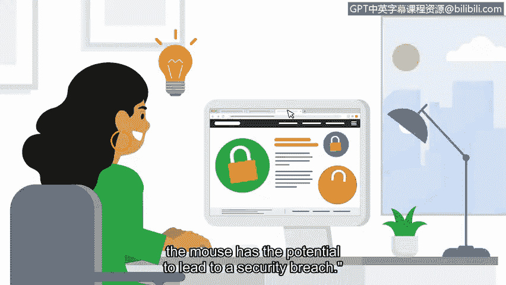

# 046：3_02 安全思维模式 🧠

## 概述
在本节中，我们将探讨一个贯穿你整个网络安全职业生涯的核心概念：**安全思维模式**。我们将了解其定义、重要性以及如何应用它来识别和防御威胁。

---

## 什么是安全思维模式？
在之前的课程中，我们讨论了各种威胁、风险和漏洞，以及它们如何影响组织的运营及其服务的人群。这些概念是构建安全思维模式时的关键考量。

拥有安全思维模式，意味着你不仅要认识到自己在**防御什么**，还要清楚自己在**防御谁或什么**。例如，识别对维持组织业务功能至关重要的资产类型，以及可能对这些资产产生负面影响的威胁、风险和漏洞类型，这一点非常重要。

而这正是安全思维模式的精髓所在。

**安全思维模式**是一种评估风险、并持续寻找和识别系统、应用程序或数据存在的潜在或实际漏洞的能力。

---

## 应用安全思维模式：以钓鱼攻击为例
在本课程项目中，我们讨论了由社会工程学攻击（如网络钓鱼）带来的威胁、风险和漏洞。这些攻击旨在破坏组织的资产，以帮助威胁行为者获取敏感信息。

运用我们的安全思维模式有助于预防此类攻击。我们必须持续关注正在发生的各类攻击。为此，养成关注最新安全趋势或漏洞信息的习惯非常有益。在这个过程中，你可能会想到保护公司数据的新思路。

安全是业内每个安全团队的日常目标。因此，拥有安全思维模式能帮助分析师抵御来自攻击者的持续压力。这种思维模式会让你意识到，每一次鼠标点击都可能潜在地导致一次安全漏洞。

---

## 安全思维模式的价值与资产保护
作为一名安全专业人员，这种严谨的审视态度能帮助你为最坏的情况做好准备，即使它并未发生。

初级分析师可以帮助保护不同级别的资产，从组织访客Wi-Fi网络这类低级资产，到知识产权、商业机密、个人身份信息乃至财务信息等高重要性资产。你的安全思维模式使你能够保护所有级别的资产。

然而，如果事件确实发生，这并不意味着你要以相同的方式应对所有事件。我们将在课程稍后部分讨论事件优先级排序。

---

## 安全思维在职业发展中的作用
在准备进入安全行业时，拥有强大的安全思维模式可以帮助你在众多候选人中脱颖而出。在未来的工作面试中提及这一基础甚至可能是一个好主意。我们将在课程后面详细讨论面试准备。

---

## 总结
本节课我们一起学习了**安全思维模式**。我们明确了它的定义是**持续评估风险并识别漏洞的能力**，探讨了如何将其应用于识别如钓鱼攻击等实际威胁，并理解了它在保护各类资产和提升职业竞争力方面的重要价值。接下来，我们将更详细地关注事件检测。