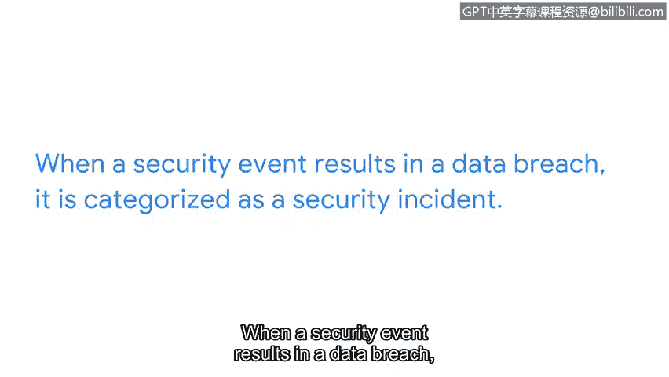

**网络安全专业证书：第八课：为网络安全工作做好准备**

**概述**

在本节课中，我们将探讨安全事件对组织关键数据和资产的影响，理解安全专业人员保护这些资产的重要性，并学习如何识别和上报潜在的安全问题。

---

**数据与资产保护的重要性**

在之前的课程中，我们讨论了安全事件可能对组织的关键数据和资产产生的影响。

如果数据和资产遭到破坏，可能导致组织蒙受经济损失。

甚至可能导致监管罚款，并失去客户或同行业其他企业的信任。

这就是为什么你在保护公司数据和资产方面的角色如此重要。

---

**安全工作中的协作**

协作是安全工作中令人兴奋的一部分。

组织中有许多人对安全的各项职能感兴趣。

没有安全专业人员可以独自完成这项工作。有些团队成员专注于保护敏感的财务数据。

另一些人则致力于保护用户名和密码。

有些人更专注于保护第三方供应商的安全。

而其他人可能关心保护员工的个人身份信息。

这些利益相关者和其他人都关注安全团队在保护组织及其服务对象免受恶意攻击方面所扮演的角色。

重要的是要认识到，你所保护的资产和数据影响着组织的多个层面。

---

**保护客户数据**

组织最关心的问题之一是保护客户数据。

客户相信与他们互动的组织会始终保护他们的数据。

这包括信用卡号、社会安全号码、电子邮件、用户名、密码等等。在承担安全角色时，牢记这一点很重要。

理解你所保护数据的重要性，是拥有强大安全思维的重要组成部分。

作为安全专业人员，谨慎处理敏感数据至关重要。

同时要关注细节，确保私人数据免受泄露。

当安全事件导致数据泄露时，它被归类为安全事件。

然而，如果事件在未导致泄露的情况下得到解决，则不被视为事件。

---

**识别与上报安全问题**

在安全行业工作时，最好保持谨慎。

这意味着要关注细节，并向你的主管提出问题。例如，

一个看似很小的问题，比如员工未经服务台许可在工作设备上安装应用程序，应该上报给主管。

这是因为某些应用程序存在漏洞，可能对组织的安全构成威胁。

一个更大的问题的例子是，注意到日志中可能执行了恶意代码。

恶意代码可能导致运营中断、严重的财务后果或关键高级资产的损失。关键是，没有太小或太大的问题。

如果你不确定事件的潜在影响，

最好保持谨慎，并向适当的团队成员报告事件。

---

**安全专业人员的责任**

每天，作为一名安全专业人员，都伴随着帮助保护组织及其人员的责任。

你所做的决定不仅影响公司，

也影响其客户和组织内无数的团队成员。

请记住，你所做的事情很重要。

---

**总结**

本节课中，我们一起学习了安全事件对组织的深远影响，理解了保护客户数据等关键资产的核心责任，并掌握了识别与上报潜在安全问题的基本原则。记住，在网络安全领域，保持警惕、注重细节和有效协作是成功的关键。