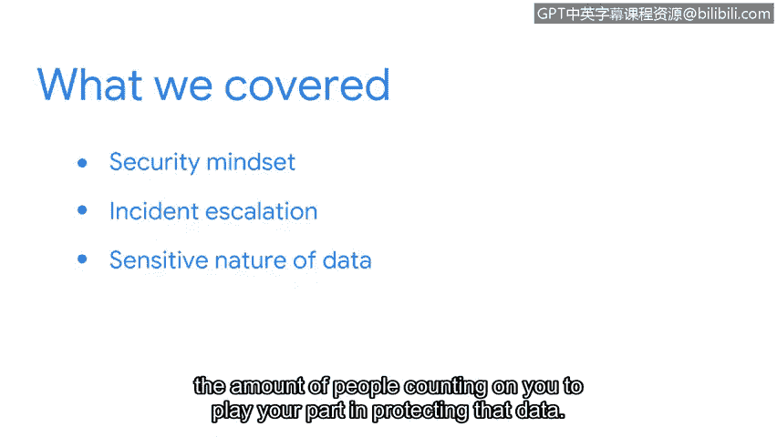

# 048：课程回顾与总结

在本节课中，我们共同探讨了初级安全分析师在保护组织数据和资产方面所扮演的关键角色。现在，让我们对所学内容进行回顾与总结。

## 课程内容回顾

上一节我们介绍了安全思维的重要性，本节中我们来快速回顾一下整个单元的核心要点。

我们首先讨论了具备安全思维的重要性，包括它如何支持安全事件的检测工作。

接着，我们审视了安全事件与普通事件之间的关系，并进一步探讨了安全事件的升级处理流程。

最后，我们探讨了您所保护数据的敏感性，以及有多少人依赖您来履行保护这些数据的职责。

## 安全团队的价值

理解您作为安全团队成员的价值，有助于您正确看待自己所做的工作。

以下是安全工作的核心原则：
*   每一条安全规则都至关重要。
*   每一位成员都为公司业务的顺畅运行贡献着力量。

## 总结与展望

本节课中，我们一起学习了初级安全分析师的核心职责、安全思维、事件处理流程以及保护数据的重要性。

我希望您能和我一样，从本次讨论中有所收获。

您准备好继续在安全领域的探索之旅了吗？在接下来的课程中，我们将讨论安全事件升级的重要性。